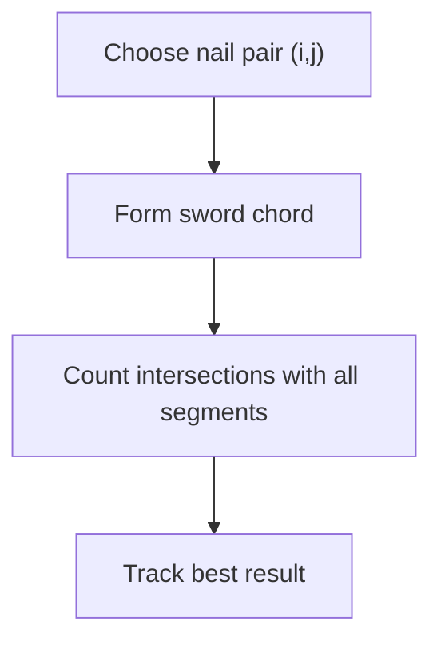
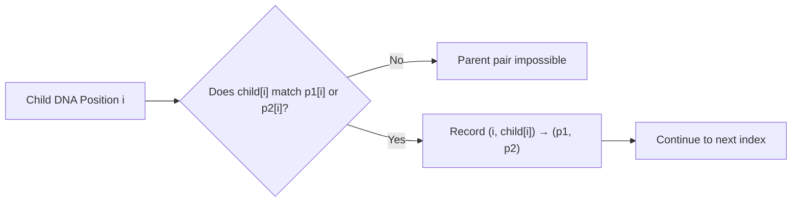
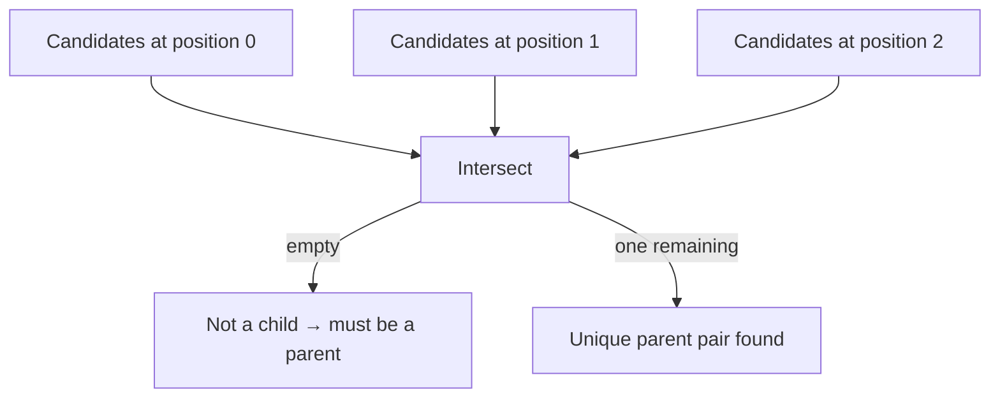
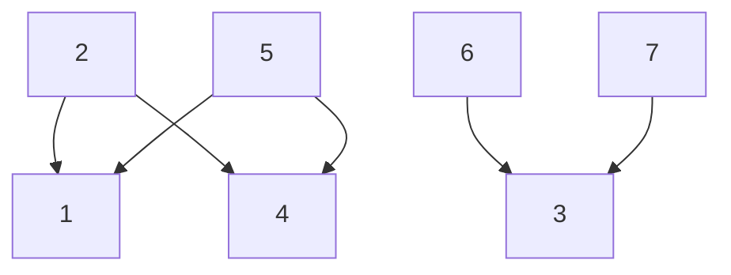
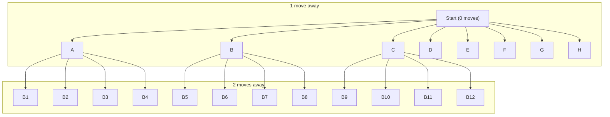
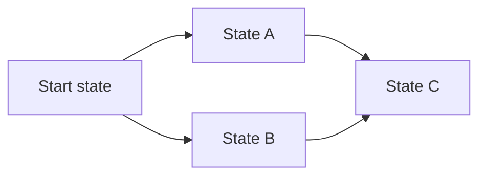
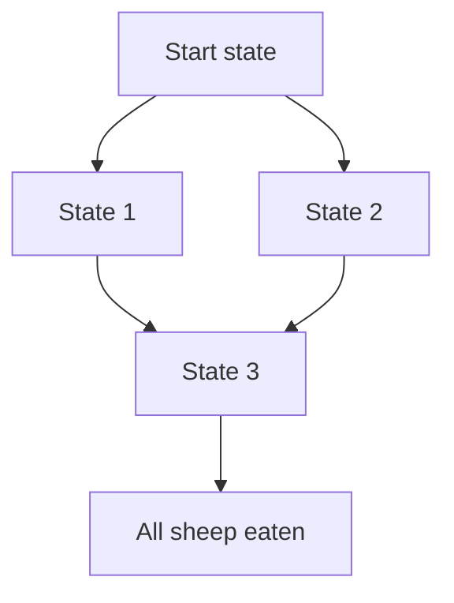
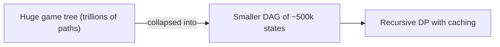

# Everybody Codes 2025

## What is Everybody Codes?
**Everybody Codes** is a yearly community-driven coding event built around a collection of puzzles, logic challenges, and programming tasks. It’s designed to be inclusive and welcoming — whether you’re a seasoned developer or brand-new to coding.  

Across the event, participants solve progressively more interesting problems that stretch skills in **data structures, algorithms, simulation, parsing, and creative problem-solving**. It’s collaborative, fun, and a great way to learn by doing.

At its core, Everybody Codes celebrates one idea:  
**anyone can code — and everyone can get better at it.**

---

## Why This Article?
Originally, I planned to write a full walkthrough of every single problem.  
But after completing the event, I realised something: not every puzzle needs a long explanation — and not every solution is equally interesting.

Instead, this article focuses on the **most notable, tricky, or clever problems** from Everybody Codes 2025 — the ones where I learned something new, had an “aha!” moment, or discovered a surprisingly elegant solution.

For each selected problem, I’ll walk through:

- **How I approached the puzzle**  
- **The reasoning behind my solution**  
- **Challenges or dead ends I ran into**  
- **The final implementation**  

The goal is not just to show answers, but to explain the *thinking* behind them — what worked, what didn’t, and how each puzzle revealed a new pattern or technique worth remembering.

---

## Before We Dive In
Some recurring themes showed up across the challenges:  
- **Input parsing**: Many puzzles use compact or ambiguous input formats that require careful preprocessing.  
- **Stateful iteration**: Several tasks involve step-by-step simulation or maintaining evolving state.  
- **Mathematical tricks**: Modulo arithmetic, boundary handling, and index mapping appear often.  
- **Data transformation**: Turning raw text into structured, usable data is half the work.  

To keep this article clean and focused, I’ll skip the simpler warmups and concentrate only on the puzzles that were particularly fun, unexpected, or thought-provoking.

---


# Quest 8 – String Art and Intersecting Lines

This quest turns away from dragonducks, DNA chains, and magical tournaments, and heads into something surprisingly mathematical and artistic: circular string-art. The aesthetic is simple — nails evenly spaced around a circle, connected with a long thread — but beneath the surface lies geometry, combinatorics, and a lot more structure than you might expect.

The puzzle is divided into three escalating challenges:

1. Count how many thread segments pass through the exact centre of the circle.
2. Count how many segment–segment intersections occur (how many knotted crossings an artist would need to tie).
3. Find the strongest sword strike — the straight line between two nails that slices through the greatest number of threads.

My final answers were:

- Part 1: 57
- Part 2: 2,927,416
- Part 3: 2800

To solve it, I ended up building a full geometric engine: mapping nails to Cartesian coordinates, converting segments to line equations, and analytically computing intersections. It’s a bit overkill for a puzzle that secretly has very elegant circle-geometry shortcuts — but I solved this at 11 PM, half-asleep, and didn’t notice the nicer methods until the next morning.

Sometimes the scenic route is the memorable route.

---

## Representing Nails on the Unit Circle

Every part of the puzzle is ultimately about segments between pairs of nails. So the first step is to represent each nail as a point in 2D space.

I mapped each nail index to a point on the unit circle, rotated such that nail 1 sits at the top:

```python
from math import sin, cos, pi

def build_coordinates(nails):
    final = {}
    angle_increment = 1 / nails
    for i in range(nails):
        y = cos(2 * pi * (i * angle_increment))
        x = sin(2 * pi * (i * angle_increment))
        final[i + 1] = (x, y)
    return final
```


---

## Part I – Counting Centre Crossings

Given a sequence of nails, how many thread segments pass exactly through the centre?

On an even-nail circle, a segment hits the centre iff it connects opposite nails:

```python
from itertools import pairwise

def part1(inp, nails):
    semi = nails // 2
    result = 0
    for n1, n2 in pairwise(inp):
        if abs(n2 - n1) == semi:
            result += 1
    return result
```

My final answer for Part I: 57

---

## Turning Segments into Line Equations

To detect intersections (Parts II and III), I converted every thread segment into its corresponding line equation:

```python
def get_line_info(p1, p2, coords):
    x1, y1 = coords[p1]
    x2, y2 = coords[p2]

    if abs(x2 - x1) < 1e-9:
        return None, None, x2  # vertical line

    slope = (y2 - y1) / (x2 - x1)
    b = y1 - slope * x1
    return slope, b, None
```

And a helper to test whether an intersection point lies strictly inside the circle:

```python
from math import sqrt

def is_in_unit_circle(x, y):
    epsilon = 0.00001
    magnitude = sqrt(x*x + y*y)
    return (-1 + epsilon) < magnitude < (1 - epsilon)
```

---

## Part II – Counting Knots (Segment Intersections)

The problem states:

- Every crossing of two segments requires a knot.
- If several intersections lie at the same location, each is still a separate knot.

So: count all segment–segment intersections inside the circle.

Intersection logic:

```python
def does_intersect(l1, l2):
    slope1, b1, v1 = l1
    slope2, b2, v2 = l2

    if v1 is not None and v2 is not None and v1 != v2:
        return False
    if l1 == l2:
        return True

    if v1 is not None:
        x = v1
    elif v2 is not None:
        x = v2
    elif abs(slope1 - slope2) < 1e-9:
        return False
    else:
        x = -(b2 - b1) / (slope2 - slope1)

    if v1 is not None:
        y = slope2 * x + b2
    else:
        y = slope1 * x + b1

    return is_in_unit_circle(x, y)
```

Count all intersections:

```python
def get_intersections(lines):
    result = 0
    for i, l1 in enumerate(lines):
        for l2 in lines[:i]:
            if does_intersect(l1, l2):
                result += 1
    return result
```

Wrapper:

```python
def part2(inp, nails):
    coords = build_coordinates(nails)
    lines = []
    for n1, n2 in pairwise(inp):
        lines.append(get_line_info(n1, n2, coords))
    return get_intersections(lines)
```

My total knot count for Part II: **2,927,416**

---

## Part III – The Best Sword Strike

A magical sword strike is simply a straight line between two nails.

The strike:

- cuts every thread it intersects  
- also cuts a thread if the thread lies exactly between those two nails  
- must choose the best pair of nails for maximum intersections

I reused the same geometric machinery.

Count intersections for a strike:

```python
def part3_intersections(tup, lines, coords):
    l_start, l_end = tup
    baseline = get_line_info(l_start, l_end, coords)
    count = 0
    for line in lines:
        if does_intersect(baseline, line):
            count += 1
    return count
```

Check all nail pairs:

```python
def part3(inp, nails):
    coords = build_coordinates(nails)
    lines = [get_line_info(a, b, coords) for a, b in pairwise(inp)]
    best = 0

    for i in range(1, nails+1):
        for j in range(i+2, nails+1):
            best = max(best, part3_intersections((i, j), lines, coords))

    return best
```

My result: **2800** threads cut by the optimal strike.

A conceptual diagram of the search:



---

## A Slightly Overengineered Solution

The funny part of this quest is that there is a much simpler way to handle intersections on a circle: for a chord between two nails, another chord intersects it if and only if one endpoint lies between them (in clockwise order) and the other lies outside that arc.

Instead of using that insight, I mapped everything to `(x, y)` coordinates on the unit circle and did full line–line intersection tests, including special cases for vertical lines and numerical epsilon checks for being inside the circle.

Was it necessary? No. Was it fun? Absolutely.

This quest ended up being a nice mix of:

- circular geometry  
- line equations and intersections  
- brute force over segment pairs  
- and a reminder that sometimes the “ridiculous” solution is still fast enough to be interesting.


# Quest 9 – Encoded in the Scales

This was one of my favourite challenges in Everybody Codes 2025. The entire puzzle revolves around inferring dragonduck family relationships purely from their DNA sequences.

Each DNA string is made from four symbols: `A`, `T`, `C`, `G`. The rules of inheritance are simple but surprisingly powerful:

> At each index in the DNA sequence, a child’s symbol must match one of the two parents’ symbols at that position.

From that rule, the puzzle asks us to figure out which scales represent children, which ones represent parents, which parent pairs belong together, how the dragons form families, and even which family is the largest.

---

## The Core Idea: Let the DNA Tell Us Who the Parents Are

A straightforward but inefficient approach would be to guess which sequences are children, then try to match them to parent pairs. Instead, I flipped the problem around:

> Assume every sequence *might* be a child, then see which parent pairs could have produced it.

If there exists exactly one parent pair capable of producing that sequence, then it must be a child. If no such pair exists, the sequence must be a parent.

This perspective makes the whole problem fall neatly into place.

---

## Building the Possibility Tree

For a candidate child and a potential parent pair `(p1, p2)`, every index in the DNA has to pass a simple test:

- if the child’s symbol matches either parent, this parent pair is still possible  
- if it doesn’t, the pair is impossible and can be discarded immediately

This leads to what I call the **possibility tree**. For every valid match at position `i`, I record that the parent pair is possible for `(i, child[i])`.

Here is the function that constructs that mapping:

```python
def _possibility_tree(n1, n2, p1, p2, child_seq):
    result = {}
    for i, (c1, c2, child_c) in enumerate(zip(p1, p2, child_seq)):
        if child_c not in (c1, c2):
            return {}
        result[(i, c1)] = (n1, n2)
        result[(i, c2)] = (n1, n2)
    return result
```

If you visualise the logic, each index is processed like this:



A parent pair that survives every index becomes a globally valid possibility for that child.

---

## Merging Possibilities for All Parent Pairs

For a given potential child, I gather possibilities across *all possible parent pairs*:

```python
def _build_parent_possibilities(di, child_num):
    result = {}
    child_seq = di[child_num]
    for num1, p1 in di.items():
        for num2, p2 in di.items():
            if num2 <= num1:
                continue
            if child_num in (num1, num2):
                continue

            possibility_tree = _possibility_tree(num1, num2, p1, p2, child_seq)

            for k, v in possibility_tree.items():
                if k not in result:
                    result[k] = set()
                result[k].add(v)
    return result
```

The final structure looks like:

```
(index, symbol) → {all parent pairs that could have produced that symbol at that index}
```

This gives a clean and flexible way to reason about each child.

---

## Intersecting Parent Possibilities to Find the True Parents

The key insight is that a real child must have exactly one parent pair that works for **every** DNA position. Which means:

- For position 0, gather all valid parent pairs  
- For position 1, gather all valid parent pairs  
- Intersect them  
- Continue for all positions  

If at any point the set becomes empty, the sequence isn’t a child at all.

This is the function that performs this deduction:

```python
def get_child_parents(child_num, child_seq):
    parent_trees = _build_parent_possibilities(di, child_num)

    result = set()

    for i, c in enumerate(child_seq):
        possible_parents = parent_trees.get((i, c))
        if not possible_parents:
            return None
        if i == 0:
            result = possible_parents
        else:
            result = result.intersection(possible_parents)
        
        if len(result) == 0:
            return None
    
    return list(result)[0]
```

Here is the conceptual flow:



This step was my favourite part of the entire quest because it produces unambiguous answers using a simple, deterministic structure. No brute force. No guessing.

---

## Finding All Children and Their Parents

Once I had a reliable way to determine parenthood, identifying all children became simple:

```python
def get_children_parents(di):
    result = {}
    for child_num, child_seq in di.items():
        parents = get_child_parents(child_num, child_seq)
        if parents is not None:
            result[child_num] = parents
    return result
```

If a node has parents, it’s a child. If not, it’s a parent.

---

## Computing Similarity Scores (Part I and II)

The puzzle defines a similarity score between a child and its two parents as:

```
matches_with_parent1 * matches_with_parent2
```

My implementation follows the puzzle’s definition directly:

```python
def get_similarity(child, parents, di):
    same_chars = {}
    for parent in parents:
        for parent_c, child_c in zip(di[parent], di[child]):
            if child_c == parent_c:
                same_chars[parent] = same_chars.get(parent, 0) + 1
    
    return math.prod(same_chars.values())
```

With parent–child mappings computed earlier, Part II simply sums all similarity scores.

---

## Constructing Family Trees (Part III)

Once every child knows its parents, we can flip the mapping:

```python
def _flip_children_parents(children_parents):
    result = {}
    for child, (p1, p2) in children_parents.items():
        if p1 not in result:
            result[p1] = set()
        if p2 not in result:
            result[p2] = set()
        
        result[p1].add(child)
        result[p2].add(child)
    
    return result
```

This gives the reverse lookup:  
`parent → children`.

Then families can be found through graph traversal. Each family is a connected component:

```python
def _get_full_tree(parent, children_parents, parents_children):
    queue = [parent]
    result = set()

    while queue:
        curr = queue.pop()
        result.add(curr)
        children = list(parents_children.get(curr, set()))
        
        for child in children:
            parents = children_parents.get(child)
            if parents is not None:
                for parent in parents:
                    if parent not in result:
                        queue.append(parent)

        queue.extend(children)

    return result
```

A family looks like this:



Everything connected belongs to the same lineage, even if the tree twists between generations or loops across siblings.

Finally, I computed all families and picked the largest:

```python
def part3(di):
    family_trees = get_family_trees(di)
    sortedd = sorted(family_trees, key=lambda x: len(x), reverse=True)
    largest_tree = sortedd[0]
    return sum(largest_tree)
```

---

## Closing Thoughts on Quest 9

This challenge was a great mix of pattern recognition, set logic, and graph traversal. The possibility tree approach turned out to be especially clean and satisfying. From that structure, everything else followed naturally, including detecting children, computing similarity scores, and building entire family lineages.

It’s the kind of puzzle that looks complicated on the surface but becomes elegant once you see the right abstraction.


# Quest 10 – Dragon Chess and the Explosion of Possibility

Quest 10 was one of the most surprising challenges in Everybody Codes 2025. It starts out as a simple movement puzzle with a dragon and some sheep, and quietly turns into a huge combinatorial search, especially in Part III. Somehow a tiny board hides trillions of different games.

---

## Part I – Four Move Reachability

The first part is a warm up: place the dragon on the board, scatter some sheep around it, and count how many sheep are within four knight moves.

I used a simple bounded breadth first search. The only thing you really need is a way to generate knight moves from a given square:

```python
def knight_moves(curr):
    cx, cy = curr
    moves = [(1, 2), (2, 1)]
    flips = [(1, 1), (-1, 1), (1, -1), (-1, -1)]

    for mx, my in moves:
        for fx, fy in flips:
            nx = cx + (mx * fx)
            ny = cy + (my * fy)
            yield (nx, ny)
```

From there I start at the dragon, explore up to depth 4, collect all visited squares, and intersect that set with the sheep positions. That gives the answer for Part I.

A high level view of this is just expanding layers around the starting square:


Every node here is a board square; after 4 layers you just check which of them hold sheep.

---

## Part II – Falling Sheep

Part II adds gravity. Each round:

1. The dragon moves like a knight.  
2. All sheep move one square down.  
3. If a sheep lands on the dragon’s square and it is not a hideout, it gets eaten.

The question is: across all possible dragon move choices over 20 rounds, how many sheep can be eaten at least once?

To avoid simulating sheep on the fly, I precompute where every original sheep would be after `t` steps:

```python
def generate_sheep_positions(sheep, board_size, n):
    boards = {}
    for i in range(n+1):
        di = {}
        for x, y in sheep:
            nx, ny = (x, y + i)
            if ny >= board_size[1]:
                continue
            di[(nx, ny)] = (x, y)
        boards[i] = di
    return boards
```

That gives me a dictionary:

- key: time step `t`
- value: a mapping from current position to original sheep position

Then I run a BFS over `(dragon_position, t)` and at each state I check:

- sheep standing on the dragon square before they move  
- sheep landing on the dragon square after they move  

If any of those are on non protected squares, I add the original sheep to a `captured_sheep` set so it is only counted once, no matter how many different paths eat it. This works fine for Part II.

---

## Part III – Every Possible Game

In the final part the rules shift again and it becomes a full game search:

- Sheep move first.  
- Only one sheep moves each sheep turn.  
- Sheep move downwards and avoid stepping onto the dragon unless there is a hideout.  
- If at least one sheep can move, exactly one of them must move; otherwise the sheep skip.  
- The dragon must always move.  
- The game ends only when every sheep has been eaten.  
- We are asked to count every distinct sequence of moves that leads to that outcome.

My first instinct was to keep using a queue and explore the game tree. That failed pretty quickly. The reason is that the same board state can be reached through many different move orders. A pure BFS keeps re exploring those states over and over.

A simplified picture of the problem looks like this:



`State C` is the same configuration reached from two different histories.  
A queue-based approach treats both paths separately, which means:

- repeated exploration  
- exponential blowup  
- and eventually running out of time or memory  

---

## The Key Realisation – State, Not History

The crucial insight was:

> Once you know the current board state (dragon position and the set of sheep positions), the number of winning continuations from that state is fixed. It does not matter how you got there.

So instead of thinking in terms of move histories, I rewrote the solution as a function over states.

### Sheep move generation

I started with a helper that generates all possible results of a single sheep turn:

```python
def all_single_sheep_moves(sheep, dragon, protected_squares):
    result = []
    for sx, sy in sheep:
        nx, ny = sx, sy + 1
        if ((nx, ny) == dragon) and ((nx, ny) not in protected_squares):
            continue
        new_sheep_state = sheep.difference({(sx, sy)}).union({(nx, ny)})
        result.append(new_sheep_state)

    if len(result) > 0:
        return result

    return [sheep]  # no sheep can move, so the state stays as it is
```

If at least one sheep can move, I generate all resulting sheep states. If none can move, I return the current set in a single element list, which represents “sheep skip their turn”.

Then there is a simple helper to detect escapes:

```python
def any_escaped_sheep(sheep, board_size):
    _, Y = board_size
    return any([sy >= Y for _, sy in sheep])
```

### Recursion with memoisation

The heart of the solution is a recursive function `count_sequences`, which returns the number of ways to finish the game from a given state:

```python
from functools import lru_cache

def part3(dragon, sheep, protected_squares, board_size):
    PROTECTED_SQUARES = protected_squares
    BOARD_SIZE = board_size
    
    @lru_cache(maxsize=None)
    def count_sequences(dragon, sheep):
        if len(sheep) == 0:
            return 1  # one complete valid game

        total = 0
        sheep_board_states = all_single_sheep_moves(sheep, dragon, PROTECTED_SQUARES)

        for sheep_state in sheep_board_states:
            if any_escaped_sheep(sheep_state, BOARD_SIZE):
                continue

            for square in knight_moves(dragon):
                if not is_in_bounds(square, BOARD_SIZE):
                    continue

                if (square in sheep_state) and (square not in protected_squares):
                    total += count_sequences(square, frozenset(sheep_state.difference({square})))
                else:
                    total += count_sequences(square, frozenset(sheep_state))
        
        return total
    
    return count_sequences(dragon, frozenset(sheep))
```

Two important details:

- Sheep sets are turned into `frozenset` so the state is hashable.  
- `@lru_cache(maxsize=None)` means each distinct `(dragon_position, sheep_set)` pair is evaluated once. If the recursion hits that state again via a different move order, it just reuses the stored result.

Conceptually, the recursion builds a directed acyclic graph (DAG) of states, not a full tree:



The same state (like `State 3`) can have multiple parents, but it is computed once and reused everywhere.

---

## Performance Notes – How the Solver Survived 32 Trillion Games

After finishing the implementation I profiled the code for Part III.  
The headline numbers are fun:

```
41075406 function calls (40573146 primitive calls) in 12.501 seconds
```

So about **41 million function calls** in roughly **12.5 seconds**, to count  
**32,177,131,563,721** distinct winning games.

Some of the key lines from the profiler:

- `15,036,633` calls to `knight_moves`  
- `13,365,896` calls to `is_in_bounds`  
- `2,587,715` calls to `frozenset.difference`  
- `2,019,035` calls to `any_escaped_sheep`  
- `502,261` calls to `count_sequences` (the recursive core)  
- `502,247` calls to `all_single_sheep_moves`  

The most important one is:

```text
502261/1  count_sequences
```

That means there were 502,261 total calls, but most hit the LRU cache and returned instantly. So the number of *unique* states explored was around half a million, even though the number of possible games is in the tens of trillions.

You can picture the difference like this:



The memoisation effectively collapses the gigantic tree of histories into a much smaller DAG of positions.

---

## Final Number and Takeaways

The final answer for my input was:

`32177131563721`

which is:

**32,177,131,563,721 different sequences**  
in which the dragon eventually eats all the sheep.

For such a small board, that number is ridiculous in the best way. It really shows how quickly game trees grow and how important it is to think in terms of **states** and **memoisation**, not just brute force search.

What I liked most about this quest is that the core rules are simple, but the only practical way to solve it is to lean into a clean state representation and let recursion plus caching do the heavy lifting.