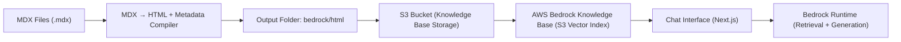
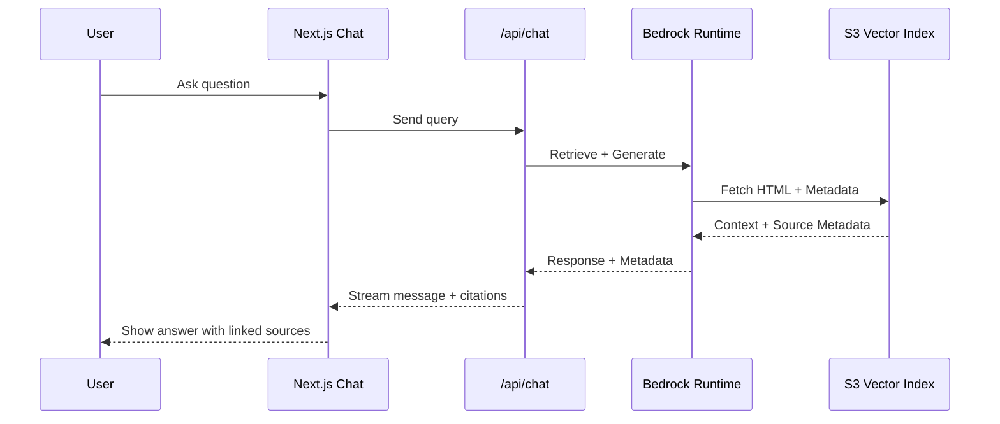

import { Callout, Metric } from "@/components/callouts"

# Building PETER with Bedrock

## Context

After building my [personal portfolio website](/my-personal-website) to showcase projects and experiments, I wanted to make it more interactive and useful.  
The goal was to create something that could explain my work, using the same structured content that powers my site.

That idea became **PETER**, short for **Personal Engineering Tech & Experience Responder**.  
It is an **AI assistant built on AWS Bedrock** that uses my portfolio content and project metadata as a knowledge base.

<Callout kind="info" title="Purpose">
PETER is not just a chatbot. It is a working example of how structured data models and semantic layers can extend beyond BI tools into conversational AI.
</Callout>

---

## The Goal

### Functional Goals
1. Let users ask questions about my projects, tools, and approach to analytics.  
2. Use **AWS Bedrock Knowledge Bases** to retrieve accurate context from real portfolio content.  
3. Automatically generate **page metadata** and **citations** so answers can point to the right sources.  
4. Extend my structured data mindset into conversational systems, not just dashboards.

### Design Goals
- Keep the interface minimal and integrated with the portfolio.  
- Ensure every response includes a source link.  
- Make the tone consistent with the rest of my content.

---

## Architecture Overview

The system builds on the same pipeline that serves my website, with a few key additions for Bedrock and Knowledge Bases.



### Components

- **Content Layer:** Converts `.mdx` files into sanitized HTML and metadata.  
- **Knowledge Layer:** Uses frontmatter fields as metadata for Bedrock retrieval.  
- **Runtime Layer:** Bedrock retrieves documents through the S3 Vector Index and returns grounded responses.  
- **Presentation Layer:** The chat UI in Next.js shows answers and linked citations.

---

## Metadata Generation

AWS Bedrock Knowledge Bases support metadata for each document. I use this to store values like title, date, stack, and canonical URL.

In the compiler script (`mdxtohtml.mjs`), each MDX file is parsed with `gray-matter`, flattened, and paired with rendered HTML.

```js
const bedrock_metadata = {
  "metadataAttributes": {
    "url": getPageUrl(filePath),
    ...flattenObject(metadata)
  }
}
```

This produces a small JSON file for each article:

```json
{
  "metadataAttributes": {
    "url": "https://peterventon.co.uk/work/ai-powered-portfolio",
    "title": "AI Powered Portfolio",
    "stack_0": "AWS",
    "projectType": "Personal project",
    "date": "02/11/2025"
  }
}
```

When a question triggers retrieval, Bedrock includes this metadata with the response.  
The chat interface uses it to show clickable citations.

<Callout kind="tip" title="Citation Handling">
Every message includes a list of retrieved sources.  
Each maps to a title and URL so users can see exactly where the information came from.
</Callout>

---

## Converting MDX to HTML

Since Bedrock does not support `.mdx` directly, I prebuild everything into clean HTML.  
The compiler handles both rendering and metadata creation.

### Processing Steps
1. Read the file and extract frontmatter with `gray-matter`.  
2. Evaluate MDX into React using `@mdx-js/mdx`.  
3. Render to static HTML with `react-dom/server`.  
4. Sanitize and serialize the output using `rehype`.  
5. Write both HTML and metadata JSON to `/bedrock/html`.

```mjs
const file = await unified()
  .use(rehypeParse, { fragment: true })
  .use(rehypeSanitize)
  .use(rehypeMermaid)
  .use(rehypeStringify)
  .process(html)

await fs.writeFile(`${slug}.html`, file.toString())
await fs.writeFile(`${slug}.html.metadata.json`, JSON.stringify(bedrock_metadata))
```

The result is a clean HTML corpus with metadata that Bedrock can index and serve.

---

## Bedrock Knowledge Base Setup

Each HTML file and its metadata are uploaded to an S3 bucket configured as a Knowledge Base source.  
Instead of OpenSearch, this setup uses the new **S3 Vector Indexing** feature to embed and retrieve documents directly from S3.

When a user asks a question:
1. Bedrock retrieves the most relevant HTML chunks and their metadata.  
2. The model generates a grounded response.  
3. The API route attaches the `metadata.url` and `metadata.title` as citations in the chat interface.



---

## Routing for Citations

Citations always link to an intentional route.  
The compiler assigns each document a URL based on where it lives and its frontmatter status.

- Published project or article → `/work/[slug]`  
- Known but unreleased project → `/bedrock/unreleased?t={title}&slug={slug}`  
- Nonexistent reference → `/bedrock/missing`  
- Knowledge Base only document → `/kb/[slug]`

This ensures every citation leads somewhere useful, even if the content is not public yet.

Example mapping:

```js
function getPageUrl(filePath, metadata) {
  const base = "https://www.peterventon.co.uk";
  const slug = /* derive from filePath */;
  const section = /* 'projects', 'kb-additional', etc. */;

  if (section === "kb-additional") return `${base}/kb/${slug}`;
  if (section === "projects") {
    const isActive = metadata?.active !== false;
    return isActive
      ? `${base}/work/${slug}`
      : `${base}/bedrock/unreleased?t=${encodeURIComponent(metadata?.title ?? slug)}&slug=${slug}`;
  }

  return `${base}/bedrock/missing`;
}
```

---

## Handling Sensitive Fields with SSM

My build process uses several environment variables such as API keys, prompts, and config values.  
To keep these out of version control, I use **AWS Systems Manager Parameter Store (SSM)** to fetch them securely during builds.

The Amplify pipeline retrieves and exports each variable before running the build.

```yaml
version: 1
frontend:
  phases:
    preBuild:
      commands:
        - npm ci
        - npx playwright install chromium
        - echo "Fetching secrets from SSM..."
        - |
          for secret in $(aws ssm get-parameters-by-path \
            --path "<secret>" \
            --with-decryption \
            --region "eu-west-2" \
            --query "Parameters[*].{Name:Name}" \
            --output text); do

              key=$(basename "$secret")
              value=$(aws ssm get-parameter \
                --name "$secret" \
                --with-decryption \
                --region "eu-west-2" \
                --query "Parameter.Value" \
                --output text)
              
              if [ "$key" = "BEDROCK_SYSTEM_PROMPT" ]; then
                echo "Writing System Prompt File..."
                echo  "$value" >> bedrock_system_prompt.txt
                continue
              fi

              echo "$key=$value" >> .env
              export "$key=$value"
          done
    build:
      commands:
        - npm run build
```

Sensitive values are stored encrypted at rest and fetched only at build time.  
Nothing sensitive is ever committed to GitHub.

<Callout kind="success" title="Result">
This setup keeps the build reproducible and secure while allowing full automation through CI/CD.
</Callout>

---

## Deduplicating Sources in the Chat Interface

Originally, multiple chunks from the same document appeared as separate sources.  
This cluttered the citation list, especially for long articles.


I fixed this by merging identical URLs and showing a count next to each title.


The result is cleaner and easier to read, while still showing how many times a document was used.

---

## Expanding the Knowledge Base

With the content and metadata pipeline in place, I began enriching the Knowledge Base with structured and external data.

- Frontmatter fields like `stack`, `projectType`, and `date` help retrieval relevance.  
- Supplemental files such as documentation or technical notes are included as additional S3 documents.  
- Bedrock indexes everything together through the S3 Vector Index, allowing PETER to combine internal and external context naturally.

This follows the same logic as BI modeling: a shared semantic layer that unifies multiple data sources.

---

## Results

<div className="mt-6 grid gap-3 sm:grid-cols-3">
  <Metric value="1" label="AWS Knowledge Base" note="Connected via Bedrock" />
  <Metric value="40+" label="Documents Indexed" note="HTML + Metadata pairs" />
  <Metric value="100%" label="Grounded Responses" note="Each answer cites its source" />
</div>

---

## Lessons Learned

- Metadata-driven design creates a self-documenting ecosystem where structure and context live together.  
- Frontmatter acts as a schema, bridging web content and data modeling.  
- The S3 Vector Index works best with small, focused documents and clean metadata.  
- Automatic citations improve transparency and trust.  
- Using SSM for secrets keeps builds safe without adding friction.

---

## Next Steps

- Add anchored section links (`/work/ai-powered-portfolio#metadata-generation`) for more precise citations.  
- Expand metadata to include dependencies and related projects.  
- Add support for external JSON schemas describing pipelines.  
- Possibly open-source the MDX to HTML compiler for Bedrock ingestion.

---

## Conclusion

PETER shows how data modeling principles like consistency and governance can improve even AI systems.  
By combining my content, metadata, and Bedrock’s retrieval pipeline, the portfolio becomes a **living knowledge system**.

Every answer now has context, provenance, and a clear source, just like any well-modeled BI platform.

> **Model once. Reuse everywhere. Scale beyond dashboards.**
