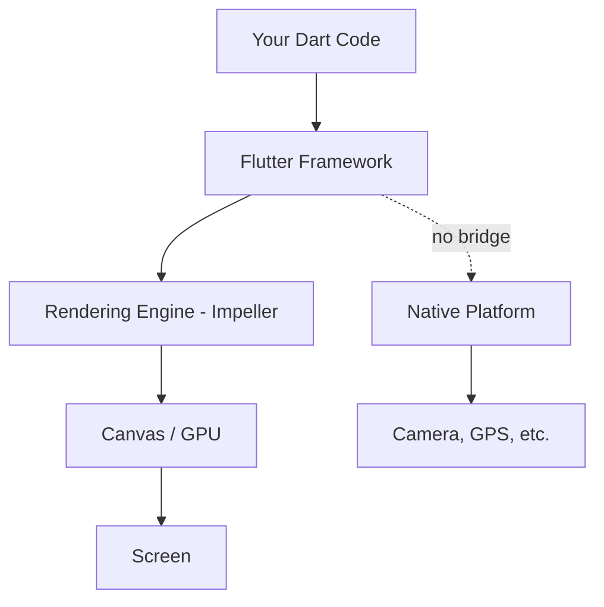
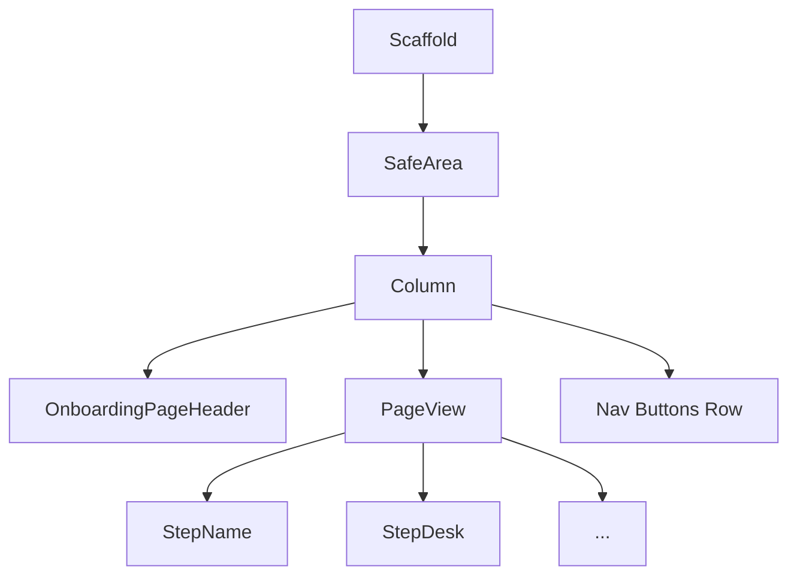
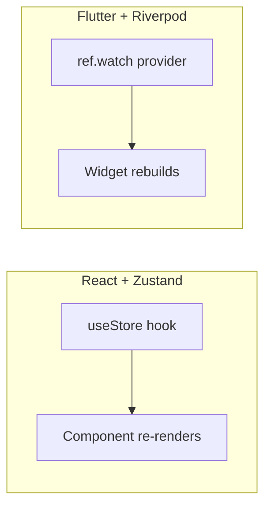
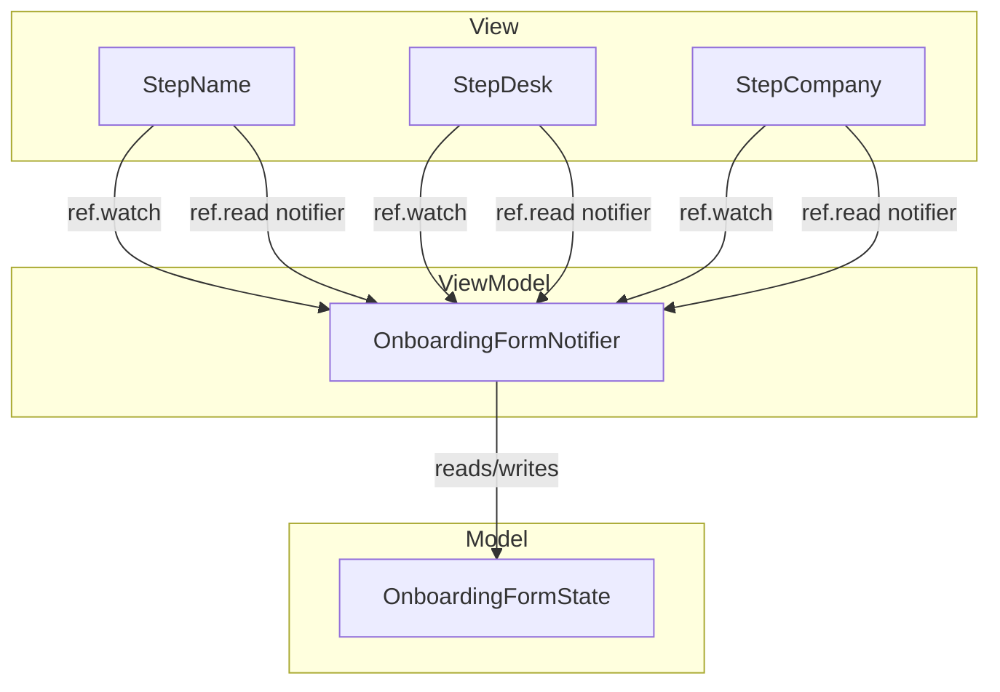
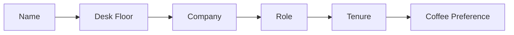
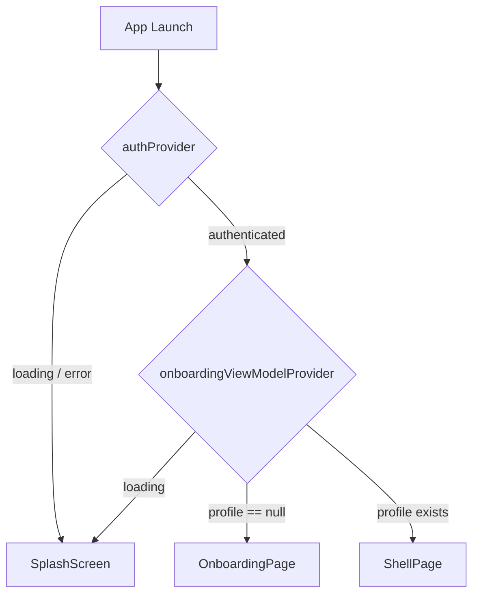
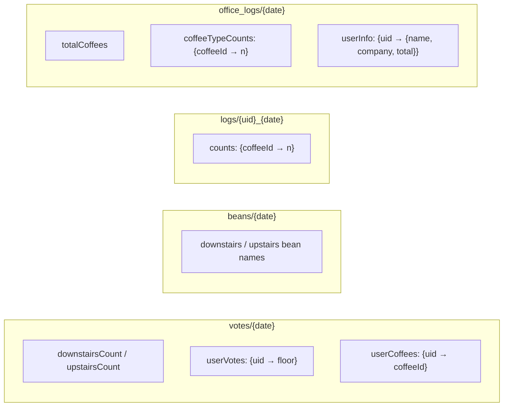
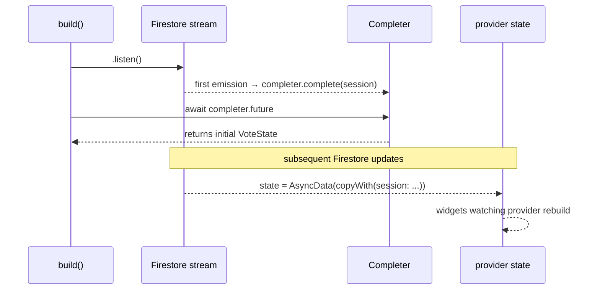
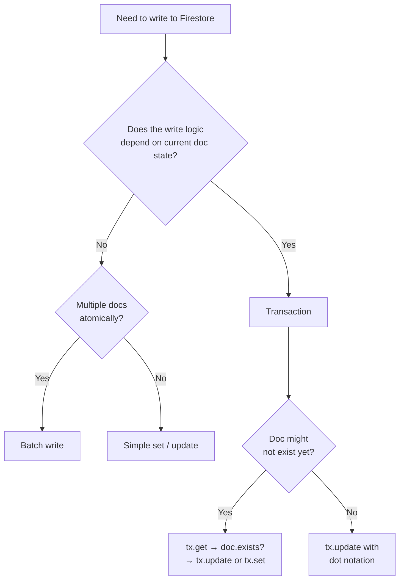
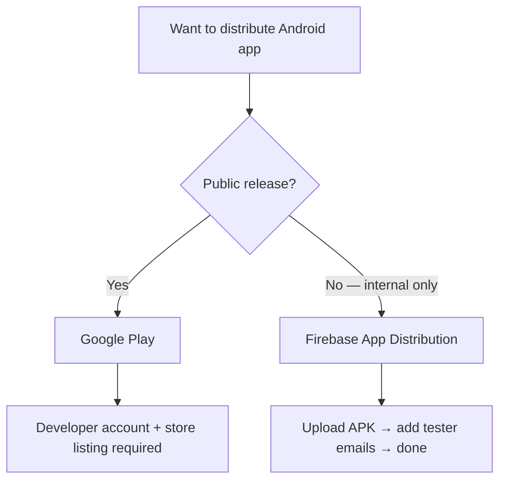

# Building a Coffee App with Flutter

### Why Flutter?

I write a lot of React. The component model, JSX, hooks, the whole ecosystem. It's been my default for years. When I needed to build a mobile app I defaulted to [React Native](https://reactnative.dev), mostly out of familiarity. But React Native always felt like a compromise: you're fighting a bridge, native modules break between versions, and the "write once" promise has enough asterisks to fill a page.

So when the opportunity for a small project came up at the office, I decided to use it as a chance to try Flutter properly. Not a tutorial, not a toy counter app. An actual project with real screens, real state, and a Firebase backend.

I'll cover where Flutter differs from what I knew, where it surprised me, and the decisions I made along the way.

---

### How Flutter actually works

Before the code, a quick mental model. Flutter is not a framework that wraps native components the way React Native does. It owns the canvas. Flutter ships its own rendering engine (Impeller, formerly Skia) and draws every pixel itself. The OS gives it a surface and Flutter does everything from there.



This means there's no native button being rendered when you write a `TextButton`. Flutter draws it. The upside is pixel-perfect consistency across platforms. The downside is that native components look native only because Flutter replicates them deliberately (`CupertinoButton` vs `ElevatedButton`).

#### The widget tree

Everything in Flutter is a widget. Not in the "components are like widgets" metaphor sense, literally everything. Padding is a widget. Alignment is a widget. If you want 16px of space, you create a `SizedBox` widget, specifically something like `SizedBox(height: 16)`. Coming from React this feels verbose at first, however I can see the appeal. Having the tree as the sole source of truth does make reasoning about layout more straightforward.



Flutter separates your widget tree into three trees under the hood (widget, element, and render) but you only think about the widget tree. The framework reconciles the rest, similarly to React's virtual DOM.

#### Dart

Flutter uses Dart. It's a typed, compiled language and honestly closer to TypeScript than anything else. If you know TypeScript you'll feel at home within a day. A few things that stood out to me:

- `final` and `const` are different. `const` is a compile time constant, whereas `final` is an immutable runtime assigned value.
- Named parameters with `required` replace prop destructuring.
- `?.` and `!` for null safe access work the same way as TypeScript's equivalents.
- `abstract final class` is a clean way to access constants: no instance, no inheritance, just a holder.

---

### The project: Coffee at Tide

The office building I work in is owned by our company, across two floors. There's a coffee machine on both floors, and there's always a low level debate about which floor has the better coffee blend. Working in data, I figured why settle it with opinions when you can settle it with numbers?

The stack I landed on:
- **Flutter** for the mobile app
- **Firebase** (Firestore + Auth) for the backend
- **Riverpod** for state management

It was a good excuse to learn Flutter properly. Simple enough to finish, but with enough moving parts to actually learn the architecture.

---

### State management: from StatefulWidget to Riverpod

My first pass used `StatefulWidget`. Flutter's built-in stateful widgets are fine for local, isolated state: a toggle, an animation, a text field controller. But once state needs to be shared across screens or widgets you're passing callbacks up and down the tree, which is the Flutter equivalent of prop drilling.

The standard solutions are `InheritedWidget` (verbose, low-level), `Provider` (the older community standard), or [Riverpod](https://riverpod.dev) (the current best-in-class). I went with Riverpod.

#### Riverpod vs Zustand

If you've used [Zustand](https://github.com/pmndrs/zustand) in React, Riverpod's mental model maps reasonably well. Both give you a store that lives outside the component/widget tree, both let you read or watch state reactively, and both update the UI when state changes.



The key difference is how you *define* state. In Zustand you write a store with mutable actions:

```ts
const useOnboardingStore = create((set) => ({
  firstName: '',
  setFirstName: (v) => set({ firstName: v }),
}))
```

In Riverpod you write a `Notifier` with immutable state transitions:

```dart
class OnboardingFormNotifier extends Notifier<OnboardingFormState> {
  @override
  OnboardingFormState build() => const OnboardingFormState();

  void setFirstName(String v) => state = state.copyWith(firstName: v);
}
```

State is replaced, not mutated. copyWith is the standard pattern for this, you return a new state object with one field changed. This was very natural because its very similar to Redux's `useReducer`, just without the ceremony of action types.

#### MVVM in Flutter

The bigger conceptual shift coming from React isn't the state library, it's the architecture. Flutter follows the well established pattern of MVVM (Model-View-ViewModel). I've come across this before when working with SwiftUI and Kotlin. React doesn't have an equivalent convention. You separate concerns via hooks and component composition, but the split is more emergent than prescribed.



In React terms: the Model is your plain data shape, the ViewModel is a custom hook that encapsulates logic and exposes actions, and the View is the component that calls that hook. Flutter makes this explicit. Your files and classes map directly to those layers and there's no question of where a piece of logic belongs.

---

### The onboarding screen

The first thing a new user sees is a multi step onboarding flow: name, desk floor, company, role, tenure, and coffee preference. Each step is a separate widget, all driven by a single shared viewmodel `OnboardingFormState`.



The steps live inside a `PageView` with `NeverScrollableScrollPhysics` so the user can't swipe between pages, only tap Continue or Back. Navigation is handled by the parent `OnboardingPage`, which owns the `PageController` and calls `nextPage`/`previousPage` in sync with the Riverpod notifier's `nextStep`/`previousStep`.

One piece of state logic worth calling out: when a user changes their company, their role selection is automatically cleared. A different company has different roles, so keeping the old selection makes no sense. The state handles this with a `clearRole` flag in `copyWith`:

```dart
OnboardingFormState copyWith({
  String? company,
  bool? clearRole,
  String? role,
  // ...
}) {
  return OnboardingFormState(
    company: company ?? this.company,
    role: clearRole == true ? null : (role ?? this.role),
    // ...
  );
}
```

And the notifier calls it as:

```dart
void setCompany(String v) {
  state = state.copyWith(company: v, clearRole: true);
}
```

I had to create the `clearRole` flag because `copyWith` can't distinguish between "this field wasn't provided" and "set this field to null" using a plain nullable parameter. The boolean gives you an explicit option to clear it.

Each step also has a validity check which lives in the viewmodel:

```dart
bool get stepIsValid {
  switch (currentStep) {
    case 0: return firstName.trim().length >= 2;
    case 1: return deskFloor != null;
    // ...
  }
}
```

The Continue button reads this and disables itself (with an opacity animation) if the current step isn't valid.

---

### Firebase setup

Getting Firebase into a Flutter project is handled by the [FlutterFire CLI](https://firebase.flutter.dev/docs/cli/). You run `flutterfire configure`, point it at your Firebase project, and it generates a `firebase_options.dart` file with your platform-specific config. Then in `main()`:

```dart
void main() async {
  WidgetsFlutterBinding.ensureInitialized();
  await Firebase.initializeApp(options: DefaultFirebaseOptions.currentPlatform);
  runApp(const ProviderScope(child: CoffeeAtTideApp()));
}
```
`WidgetsFlutterBinding.ensureInitialized()` is needed any time you do async work before `runApp`. Firebase initialisation is one of those cases.

Worth noting: this was noticeably smoother than integrating something like AWS Cognito into a React Native project, where you often find yourself fighting libraries that were built for web first and mobile second.

For auth I'm using anonymous sign in, provided by Firebase out of the box. No accounts, no passwords, just a stable uid per install. Full sign in would have worked, but I didn't want to store employee details. It really is just a leaderboard, and I wasn't comfortable holding onto that kind of info unnecessarily.

```dart
// sign in anonymously if no existing session, riverpod caches so safe to watch from multiple places
final authProvider = FutureProvider<User>((ref) async {
  final auth = FirebaseAuth.instance;
  if (auth.currentUser != null) return auth.currentUser!;
  final result = await auth.signInAnonymously();
  return result.user!;
});
```

`FutureProvider` wraps the result in `AsyncValue`, so anything watching it gets loading, error, and data states for free. This is the same pattern as TanStack Query in React: .data, .isLoading, .error. `Future` itself is Dart's equivalent of a JavaScript `Promise`. Riverpod also caches the result (just like Tanstack Query), so calling this from multiple widgets doesn't trigger multiple sign in attempts.

---

### App routing

Flutter doesn't have a router baked in the way React Router does. For this app the routing logic is simple enough that I just used a widget that watches auth state and decides what to show:

```dart
class _AppRouter extends ConsumerWidget {
  const _AppRouter();

  @override
  Widget build(BuildContext context, WidgetRef ref) {
    final authState = ref.watch(authProvider);

    return authState.when(
      loading: () => const _SplashScreen(),
      error: (_, _) => const _SplashScreen(),
      data: (_) {
        final onboardingState = ref.watch(onboardingViewModelProvider);
        return onboardingState.when(
          loading: () => const _SplashScreen(),
          error: (_, __) => const Text("error"),
          data: (profile) {
            if (profile == null) return const OnboardingPage();
            return ShellPage();
          },
        );
      },
    );
  }
}
```

The pattern is: wait for auth, then check Firestore for an existing user profile. If there's no profile send them to the onboarding widget. If there is one, show the main app.



`AsyncValue.when()` is how you consume that loading, error, and data state in the UI. It forces you to handle all three cases explicitly, which is good discipline even if it's slightly verbose.

---

### The shell page and bottom nav

The shell is a `Scaffold` with an `IndexedStack` for the pages and a custom nav bar at the bottom.

`IndexedStack` keeps all pages mounted but only shows one at a time. The alternative is swapping widgets in and out, but that means pages lose their scroll position and state every time you switch tabs. `IndexedStack` avoids that at the cost of keeping all pages in memory.

```dart
final shellTabProvider = NotifierProvider<ShellTabNotifier, int>(ShellTabNotifier.new);

class ShellTabNotifier extends Notifier<int> {
  @override
  int build() => 0;

  void goTo(int index) => state = index;
}
```

The nav bar is a custom widget. I built it before I knew `BottomNavigationBar` existed, but since mine is simple enough I never hit a wall that sent me looking for a built-in alternative. Each `NavItem` child has an animated indicator bar above the icon that slides in from zero width when selected:

```dart
AnimatedContainer(
  duration: const Duration(milliseconds: 200),
  width: isSelected ? 24 : 0,
  height: 3,
  decoration: BoxDecoration(
    color: AppTheme.wfgGreen,
    borderRadius: BorderRadius.circular(2),
  ),
),
```

`HitTestBehavior.opaque` on the `GestureDetector` wrapping each nav item initially messed me up:

```dart
// without this the tap area only covers the icon/text, not the full expanded cell
GestureDetector(
  behavior: HitTestBehavior.opaque,
  onTap: () => onTap(index),
```

Without it, tapping the empty space between the icon and label does nothing. `HitTestBehavior.opaque` makes the entire bounding box tappable.

The callback type is `ValueChanged<int>`, which is Flutter syntactic sugar for `void Function(int value)`. The React equivalent would be something like `(i: number) => void`. It's the same idea, Flutter just gives it a name.

---

### Widget decomposition on the vote page

The vote page is the main screen. It has a header, a date row, a coffee type selector, two voting cards (one per floor), a results bar, and a profile chip at the bottom.

The pattern I settled on was extracting anything with its own visual identity into its own widget file, since I didn't want the votepage to be a 1000+ line file with all the components declared inline:

```
features/vote/view/
  vote_page.dart
  widgets/
    vote_header.dart
    vote_status_row.dart
    vote_prompt.dart
    coffee_selector.dart
    vote_card.dart
    results_bar.dart
    profile_chip.dart
```

`vote_page.dart` then becomes just a `SingleChildScrollView` with a `Column` listing the pieces:

```dart
SingleChildScrollView(
  child: Column(
    children: [
      VoteHeader(profile: profile),
      VoteStatusRow(hasVoted: voteState.session.hasVoted, total: voteState.session.total),
      VotePrompt(hasVoted: voteState.session.hasVoted),
      const CoffeeSelector(),
      // vote cards...
      const ResultsBar(),
      if (profile != null) ProfileChip(profile: profile),
    ],
  ),
)
```

`SingleChildScrollView` is the right tool when you just want a scrollable column. I initially followed some tutorials that used `CustomScrollView` with `SliverToBoxAdapter` wrapping every section, but that's overkill here. `CustomScrollView` earns its keep when you need a collapsing app bar or a mixed list/grid layout.

---

### The Firestore data model

Firestore is a NoSQL document database, so the design pattern is different from SQL. Rather than normalizing data into tables and joining at query time, you design around how the app reads the data. Duplicating fields across documents and fanning out on writes is normal and expected. The goal is ridiculously fast reads.

In order to achieve this I created two collections which power the voting:

**`votes/{date}`**: one document per day. It stores the aggregate counts and a map of which user voted for which floor, i.e.:

```
votes/2026-03-23
  downstairsCount: 5
  upstairsCount: 3
  userVotes:
    uid_abc: "downstairs"
    uid_xyz: "upstairs"
```

**`beans/{date}`**: This one is manually managed via the Firebase console. When new beans arrive, I add a new document. The app fetches all documents and picks the most recent one, which also acts as the current voting period. If a user has already voted against that document, the vote button is disabled.

```
beans/2026-03-10
  downstairs: "Bean A"
  upstairs: "Bean B"
```

The beans collection is small (one document per rotation, a handful per year) so I sort client side rather than adding a Firestore index. Since the keys are `YYYY-MM-DD`, a simple `.sort()` on the strings gives chronological order for free.

```dart
Stream<BeanRotation?> watchCurrentBeans() {
  return _db.collection('beans').snapshots().map((snapshot) {
    if (snapshot.docs.isEmpty) return null;
    final docs = snapshot.docs.toList()..sort((a, b) => b.id.compareTo(a.id));
    final doc = docs.first;
    return BeanRotation.fromFirestore(doc.data(), doc.id);
  });
}
```

I'm not going to pretend `watchCurrentBeans()` isn't a funny method name. It sounds like something from a smart fridge API. But it does exactly what it says.

Two more collections handle coffee logging. Here's the full picture:



The provider watching it is about as concise as Riverpod gets:

```dart
final currentBeansProvider = StreamProvider<BeanRotation?>((ref) {
  return ref.read(firestoreRepositoryProvider).watchCurrentBeans();
});
```

`StreamProvider` handles the stream subscription lifecycle automatically. Any widget that watches it gets `AsyncValue<BeanRotation?>` with loading, error, and data states. When the Firestore document changes, every widget watching this provider rebuilds with the new data.

---

### Async state in the vote viewmodel

The vote viewmodel is an `AsyncNotifier` that subscribes to a Firestore stream for live vote updates. The part that caused trouble initially is that you need the initial value synchronously to return from `build()`, but subsequent updates need to go through state.

The naive approach is to subscribe twice, once to get the initial value with `.first`, then again with `.listen()` for updates. That creates two Firestore connections. The cleaner approach uses a `Completer`:

```dart
@override
Future<VoteState> build() async {
  final user = await ref.watch(authProvider.future);
  final repo = ref.read(firestoreRepositoryProvider);
  final today = _todayString();

  // single subscription — completer captures the first emission as the
  // initial value, subsequent updates go straight into state
  final completer = Completer<VoteSession>();
  final sub = repo.watchVoteSession(user.uid, today).listen((session) {
    if (!completer.isCompleted) {
      completer.complete(session);
    } else if (state.value != null) {
      state = AsyncData(state.value!.copyWith(session: session));
    }
  });
  ref.onDispose(sub.cancel);

  return VoteState(session: await completer.future);
}
```

One subscription. The first emission completes the `Completer` and becomes the initial state. Every emission after that updates `state` directly, which triggers a rebuild in any widget watching the provider.



---

### A meticulous bug

Once the vote logic was in place I noticed something: you could vote as many times as you wanted. The count went up each time. The `hasVoted` check wasn't working.

The `castVote` transaction was writing the user's vote like this:

```dart
tx.set(
  ref,
  {'userVotes.$uid': floor.name},
  SetOptions(merge: true),
);
```

The intention was to write into a nested `userVotes` map using dot notation. What actually happened was Firestore stored `'userVotes.$uid'` as a literal field name. The document looked like this:

```
votes/2026-03-23
  downstairsCount: 1
  userVotes.uid_abc: "downstairs"   <-- not nested, just a weird key
```

So when the app read it back:

```dart
final userVotes = data['userVotes'] as Map<String, dynamic>? ?? {};
```

`data['userVotes']` returned null. There was no `userVotes` map. `hasVoted` was always false. The UI let you keep voting.

The distinction is that `set()` with `merge: true` doesn't interpret dot notation as a field path. Only `update()` does. The fix splits into two cases depending on whether the document exists:

```dart
if (doc.exists) {
  // update() supports dot notation for nested fields
  tx.update(ref, {
    field: FieldValue.increment(1),
    'userVotes.$uid': floor.name,
  });
} else {
  // set() for creating the document fresh, no dot notation needed
  tx.set(ref, {
    field: 1,
    'userVotes': {uid: floor.name},
  });
}
```

After the fix the document structure is actually nested and `hasVoted` works correctly.

---

### The animated coffee cup I gave up on

The app header has a small animated coffee cup with rising steam. It's a `CustomPainter` with an `AnimationController` running on repeat. The cup body, rim, saucer, handle and coffee surface are all drawn with `Canvas` paths and ovals. The steam wisps use `cubicTo` curves and `sin()` offsets to wobble as they rise.

```dart
// "Where were you when I laid the foundations of the earth?
//  Tell me, if you have understanding. Who fixed its measurements?
//  Surely you know!" — Job 38:4-5
//
// Claude knows. Claude drew this cup.
class SteamCup extends StatefulWidget {
```

I started writing the painter myself. Got the cup body done, got the rim roughly right, then spent about 20 minutes trying to get the handle curve to look like a handle and not a parenthesis. At that point I handed it to Claude and it produced something reasonable on the first attempt.

To be fair, for a more serious app you'd use [Lottie](https://pub.dev/packages/lottie) for this. Lottie plays After Effects animations exported as JSON, which means your designer gives you a file and you drop it in. `CustomPainter` is more appropriate for things that need to be parameterised at runtime, like charts or progress indicators. A decorative illustration is exactly the kind of thing Lottie is for. But this is a coffee app for my office and I'm not getting a designer involved, so custom painter it is.

---

### Coffee logging and the same bug, again

The second main feature is coffee logging: each user taps a coffee type to log it. The app shows their personal count for the day alongside an office wide total and a leaderboard.

That needs two documents written atomically on every increment:

- `logs/{uid}_{date}` - the user's personal counts per coffee type
- `office_logs/{date}` - the office aggregate: total coffees, counts per type, per user info for the leaderboard

The personal log is straightforward. The office aggregate is where it gets interesting because it has nested maps for per type and per user counts:

```
office_logs/2026-03-28
  totalCoffees: 12
  coffeeTypeCounts:
    flat_white: 5
    espresso: 4
    latte: 3
  userInfo:
    uid_abc:
      firstName: "Pete"
      company: "Tide"
      total: 3
    uid_xyz:
      firstName: "James"
      company: "Other Co"
      total: 2
```

To atomically increment `coffeeTypeCounts.flat_white` you need `update()` with dot notation. But if the document doesn't exist yet (first coffee of the day), `update()` will throw. And `set()` with `merge: true` can't atomically increment nested map keys, it only merges at the top level. So you're back to the same transaction pattern from the vote bug:

```dart
await _db.runTransaction((tx) async {
  final officeDoc = await tx.get(officeRef);

  // personal log is always a set+merge — creates or updates, no nested increments needed
  tx.set(logRef, {
    'counts': {coffeeId: FieldValue.increment(1)},
  }, SetOptions(merge: true));

  if (officeDoc.exists) {
    // update() supports dot notation — only touches the specified subfields
    tx.update(officeRef, {
      'totalCoffees': FieldValue.increment(1),
      'coffeeTypeCounts.$coffeeId': FieldValue.increment(1),
      'userInfo.$uid.total': FieldValue.increment(1),
      'userInfo.$uid.firstName': firstName,
      'userInfo.$uid.company': company,
    });
  } else {
    // first coffee of the day — create the document fresh
    tx.set(officeRef, {
      'totalCoffees': 1,
      'coffeeTypeCounts': {coffeeId: 1},
      'userInfo': {
        uid: {'firstName': firstName, 'company': company, 'total': 1},
      },
    });
  }
});
```

One Firestore rule that bit me: in a transaction, all reads must come before any writes. You can't interleave them. The SDK will throw if you try. Here the `tx.get(officeRef)` comes first, then all the writes. That order isn't arbitrary.

The decrement is simpler because you can only decrement a count that's already above zero, this is enforced on the UI side so the document always exists. No transaction needed, a batch write is enough:

```dart
final batch = _db.batch();
batch.update(logRef, {'counts.$coffeeId': FieldValue.increment(-1)});
batch.update(officeRef, {
  'totalCoffees': FieldValue.increment(-1),
  'coffeeTypeCounts.$coffeeId': FieldValue.increment(-1),
  'userInfo.$uid.total': FieldValue.increment(-1),
});
await batch.commit();
```

The distinction between **batch** and **transaction** in Firestore is essentially: batch is fire and forget (no reads, just writes sent as an atomic unit), transaction is read then write. Use batch when you know the documents exist and just need multiple writes to land together. Use a transaction when the write logic depends on the current state of the document.



---

### The stats page

The stats page watches the `office_logs/{date}` document in real time and derives everything from it. There's no aggregation query, no secondary collection. The document already has `totalCoffees`, `coffeeTypeCounts`, and `userInfo`, the stats page just reads them.

`userInfo` comes back as a flat map keyed by uid. I sort by `total` descending and derive `companyTotals` in the same pass:

```dart
final leaderboard = userInfoRaw.entries.map((e) {
  final info = e.value as Map<String, dynamic>;
  return LeaderboardEntry(
    firstName: info['firstName'] as String? ?? '',
    company: info['company'] as String? ?? '',
    total: (info['total'] as num?)?.toInt() ?? 0,
  );
}).where((e) => e.total > 0).toList()
  ..sort((a, b) => b.total.compareTo(a.total));

final companyTotals = <String, int>{};
for (final e in leaderboard) {
  companyTotals[e.company] = (companyTotals[e.company] ?? 0) + e.total;
}
```

The `..sort()` is Dart's cascade operator, it calls `sort` on the list and returns the list itself, so you can chain it inline on the result of `toList()`. Equivalent to calling `sort()` on the next line, just more compact.

The `StreamProvider` for this is four lines:

```dart
final todayStatsProvider = StreamProvider<TodayStats>((ref) {
  final date = DateFormat('yyyy-MM-dd').format(DateTime.now());
  return ref.read(firestoreRepositoryProvider).watchOfficeDayStats(date);
});
```

Every time someone logs a coffee the document updates, the stream emits, and every widget watching `todayStatsProvider` rebuilds with fresh data. No polling, no manual refresh.

---

### Firebase: the good, the bad, and the ugly

The Flutter/Firebase integration is seamless. That's not a coincidence, both are Google products and FlutterFire is well maintained. But after building this app I have a more nuanced view than "it just works".

#### The good

**Real-time out of the box.** Every `watchX()` method in the repository is just a Firestore stream piped through a `StreamProvider`. That's it. When a document changes every listener gets the update automatically. In a React app with a traditional REST API you'd be polling, using websockets, or reaching for something like [React Query](https://tanstack.com/query) with a refetch interval. Here it's the default.

**`FieldValue.increment()` is genuinely useful.** Server-side atomic increments mean multiple users can log coffees simultaneously without race conditions. The counter is always accurate regardless of how many clients are writing at once. You can't do this safely with a read-modify-write pattern.

**Anonymous auth is underrated.** For an internal office app where you don't want passwords, anonymous sign-in gives you a stable uid per install with one line. The user never knows there's an auth layer. Their profile just persists.

**Date-keyed documents.** Keying documents by `YYYY-MM-DD` means you never write a query to get today's data. You just know the document ID. And sorting by document ID is lexicographically the same as sorting chronologically. Simple patterns go a long way.

#### The bad

**Read costs are confusing.** I opened the Firebase console one morning to find 1,800 reads from the previous day. Solo development, just me on a simulator. That number sounded alarming.

Turns out roughly half of them were from the Firebase console itself. When you open a collection in the console it runs something like `SELECT __collection__ PageSize 300`, that's reads. Every time you open a document, refresh, navigate between collections, that's more reads. The console is a Firestore client. It's not free to look at your data.

The other half was legitimate listener reads from hot reloads and restarts during development. Every restart re-establishes all stream listeners. Each listener establishment charges one read for the initial snapshot. Multiply by a few dozen restarts across the day and it adds up. In production with real users, those same reads are spread across a day not concentrated in a dev session.

**Real-time listeners scale linearly with users.** Every document write triggers a new snapshot for every connected listener. If 10 people are watching `office_logs/2026-03-28` and one person logs a coffee, that's 10 reads, one for each listener receiving the updated document. For a small office app this is noise. For an app with thousands of concurrent users this is a cost you need to think about.

**Security rules are opt-in.** The default Firestore rules during development are open: any authenticated user can read and write anything. That's fine while you're building but it's easy to forget to lock things down. Before this goes to anyone beyond the office I'll need rules that enforce: users can only write to their own `logs/{uid}_{date}` documents, and `office_logs` and `votes` can be written by any authenticated user but not deleted arbitrarily.

#### The ugly

The `set()` vs `update()` distinction, and knowing when you need a transaction vs a batch, is the thing that catches you every time you add a new write path. The mental model you need:

- `set()` without merge: overwrites the entire document
- `set()` with `merge: true`: merges at the top level, but can't atomically increment nested keys
- `update()` with dot notation: targets specific nested fields, works with `FieldValue.increment()`, but throws if the document doesn't exist
- transaction: lets you read the document first and decide which of the above to use

You end up writing this check over and over:

```dart
if (doc.exists) {
  tx.update(ref, { 'nested.field': FieldValue.increment(1) });
} else {
  tx.set(ref, { 'nested': {'field': 1} });
}
```

It's not hard once you know it, but it's the kind of thing that isn't obvious from the documentation until you hit the bug. I hit it twice, once in the vote transaction and once in coffee logging, before it was properly burned into my brain.

The other ugly thing is the transaction read-before-write constraint. Firestore transactions require all reads to come before any writes. If you're writing a transaction that touches multiple documents you need to collect all your reads first, then do all your writes. Structure your transaction code to front-load the reads, otherwise you'll get a runtime error that's not immediately obvious.

---

### Building for Android

Flutter supports Android out of the box. `flutter build apk` for a distributable binary, `flutter build appbundle` for a Google Play AAB. Both are one command. That part is genuinely easy.

What isn't easy is the Android toolchain, which has a habit of being quietly out of date.

#### The Java version problem

First build attempt:

```
Android Gradle plugin requires Java 17 to run. You are currently using Java 11.
Your current JDK is located in /Applications/Android Studio.app/Contents/jbr/Contents/Home
```

The root cause was an old Android Studio, the bundled JDK was Java 11. I'd used Flutter briefly back in 2020 but never touched it again after that, and hadn't done anything JVM related since, so the install had just sat there. To fix it I updated Android Studio, since the newest install ships Java 21. Then I pointed Flutter at it:

```bash
flutter config --jdk-path "/Applications/Android Studio.app/Contents/jbr/Contents/Home"
```

Run `flutter doctor --verbose` after any Android Studio update to check Flutter picked up the new JDK path.

#### The keystore

Android release builds require a signing keystore. You generate one once and keep it forever. If you lose it you can't publish updates to an existing app on Google Play.

```bash
keytool -genkey -v -keystore ~/upload-keystore.jks -keyalg RSA \
        -keysize 2048 -validity 10000 -alias upload
```

The keystore details (alias, passwords, path) go in `android/key.properties`, which is referenced from `build.gradle.kts` and should never be committed to git. The Gradle config reads it at build time:

```kotlin
val keystoreProperties = Properties()
val keystorePropertiesFile = rootProject.file("key.properties")
if (keystorePropertiesFile.exists()) {
    keystoreProperties.load(FileInputStream(keystorePropertiesFile))
}
```

The `if (keystorePropertiesFile.exists())` guard means debug builds still work for teammates who don't have the keystore locally.

#### Package name

The application ID (`com.peterventon.coffeeattide`) is set in `build.gradle.kts` and in `AndroidManifest.xml`. It also needs to match the package name registered in Firebase. If you change it after creating the Firebase project you'll need to register a new Android app in the Firebase console and replace `google-services.json`. This is exactly what happened here after changing from the default `com.example.coffee_at_tide`.

---

### AAB vs APK

Google Play wants `.aab` (Android App Bundle). Firebase App Distribution wants `.apk`. They're not interchangeable.

```
flutter build appbundle   → build/app/outputs/bundle/release/app-release.aab
flutter build apk         → build/app/outputs/flutter-apk/app-release.apk
```

The AAB is smaller because Google Play generates per-device APKs from it, so users only download the native code and assets for their specific device. The APK is a fat binary with everything included. For internal distribution the size difference doesn't matter, so APK is fine.

---

### Google Play vs Firebase App Distribution

The goal was simple: get the app onto a few Android phones in the office without making it public. Two options:

**Google Play Internal Testing**: requires a developer account ($25 one-time), identity verification (takes a few days, requires uploading ID documents), and completing a full store listing before you can upload anything. Even for a private internal track.

**Firebase App Distribution**: upload an APK directly, add tester emails, they get a link. No developer account, no store listing, no identity verification.

For internal office use Firebase App Distribution wins easily. The friction for Google Play isn't justified until you actually want to publish publicly.



The one thing to know about Firebase App Distribution: testers need to install the **Firebase App Tester** app on their device first. They get a link in the invite email that walks them through it. After that, new releases show up in the app automatically.