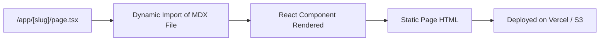
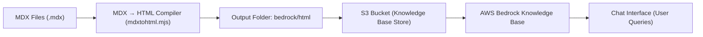
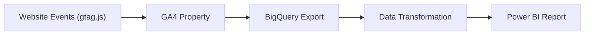
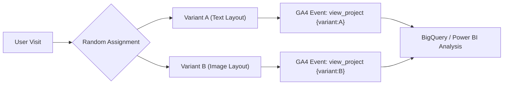
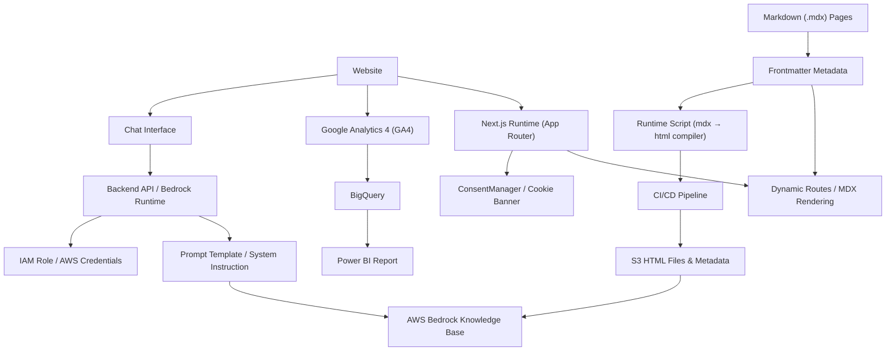

import { Callout, Metric } from "@/components/callouts"

# Building a Portfolio

## Context

In order to showcase my skillset and abilities I thought it'd be best to create a website. I did this using [Next.js](https://nextjs.org/), a [React](https://react.dev/) framework. In case you're unfamilar React is a javascript/typescript based UI framework. Its what lets me create cards like the one below.

<Callout kind="warning">I'm a callout</Callout>

To create this card I have a component, you can think of a component as a function that returns [jsx](https://react.dev/learn/writing-markup-with-jsx).

```tsx
import { Info, CheckCircle2, AlertTriangle, ShieldAlert, Lightbulb, type LucideIcon } from 'lucide-react'

type Kind = 'info' | 'success' | 'warning' | 'danger' | 'tip'

const STYLES: Record<Kind, { icon: LucideIcon; box: string; badge: string }> = {
  info: {icon: Info, box: 'bg-sky-50 border-sky-200', badge: 'bg-sky-100 text-sky-800' },
  success: {icon: CheckCircle2, box: 'bg-emerald-50 border-emerald-200', badge: 'bg-emerald-100 text-emerald-800' },
  warning: {icon: AlertTriangle, box: 'bg-amber-50 border-amber-200', badge: 'bg-amber-100 text-amber-800' },
  danger: {icon: ShieldAlert, box: 'bg-rose-50 border-rose-200', badge: 'bg-rose-100 text-rose-800' },
  tip: {icon: Lightbulb, box: 'bg-violet-50 border-violet-200', badge: 'bg-violet-100 text-violet-800' },
}

export function Callout({
  kind = 'info',
  title,
  children,
  className,
}: {
  kind?: Kind
  title?: string
  children: React.ReactNode
  className?: string
}) {
  const { icon: Icon, box, badge } = STYLES[kind]
  return (
    <aside role="note" className={`rounded-xl border p-4 ${box} ${className ?? ''}`}>
      <div className="mb-2 inline-flex items-center gap-2">
        <span className={`inline-flex items-center gap-1 rounded-full px-2 py-0.5 text-xs ${badge}`}>
          <Icon className="h-4 w-4" />
          <span className="capitalize">{title ?? kind}</span>
        </span>
      </div>
      <div className="text-sm text-neutral-800">{children}</div>
    </aside>
  )
}

export default Callout
```

As you can see there's 5 different types of callouts I've defined.
```ts
type Kind = 'info' | 'success' | 'warning' | 'danger' | 'tip'
```

Additionally I can create the callout like below.

```tsx
<Callout kind="warning">I&apos;m a callout</Callout>
```

## The End Goal

### Functionality

Ignoring the design for a second there was some core functionality I wanted the website to have, namely:

1. A clear hero with a call to action on the [homepage](https://www.peterventon.co.uk/)
2. The ability to showcase projects which push the boundaries of a traditional portfolio
3. A gpt like interactive chat that allows people to ask questions about me with the response linking them to relevant sections
4. An about me page and a place to publish articles using markdown
5. The ability to add mermaid charts into markdown files and precompile the svgs as a static asset

### Design

I'm not a design expert but I wanted the website to represent me. I've always found minamalistic design to be beautiful when done correctly, hence you can probably see the website isn't flashy.

## Building the site

Most of the build moved quickly because I’d already sketched the layout in [Figma](https://www.figma.com/). The first real decision was **how to publish articles** without dragging in a full CMS.

I knew I wanted **Markdown/MDX** so content is easy to edit and version with the code. Next.js plays nicely here: I enabled MDX with a couple of **remark/rehype** plugins (including GitHub-flavoured markdown) so I get tables, task lists, and autolinked headings out of the box.

### Adding Markdown Support

The default “one MDX file per route folder” pattern (e.g. `app/foo/page.mdx`) didn’t scale for me because every article would live in a different directory. Instead, I created a single dynamic route `app/[slug]/page.tsx` and keep all posts together in a common folder (`src/app/md-pages`). At **build time**, `generateStaticParams()` reads that folder to produce slugs, and the page loads the matching MDX:

```tsx
// app/[slug]/page.tsx (simplified)
import { articles } from "@/data/articles"

export default async function Page({
  params,
}: {
  params: Promise<{ slug: string }>
}) {
  const { slug } = await params
  const { default: Post } = await import(`@/app/md-pages/${slug}.mdx`)
 
  return <Post />
}
 
export function generateStaticParams() {
  
  const slugs = articles.map(a => ({slug: a.slug}))
  return slugs
}
 
export const dynamicParams = false
```

This gives me clean URLs like /report-migration, a single source of truth for content, and no CMS overhead. The full architecture can be seen below:



### Integrating AWS Knowledge Base

Since I wanted to add a chatbot to the site to showcase my ability to use cutting edge technology I was happy to see knowledge base supported markdown files natively. The issue was I wasn't using `.md` files, I'm using `.mdx` files. These are exactly the same as markdown but it lets me use react components inside my markdown. 

i.e. On my report migration article you'll see the below.

<div className="mt-6 grid gap-3 sm:grid-cols-3">
  <Metric value="100+" label="Reports Rebuilt" note="Over the course of 1 year" />
  <Metric value="5" label="Critical DW issues fixed" note="Issues which impacted our P&L" />
  <Metric value="6x" label="Faster response time" note="Weeks &rarr; Days for complex reports" />
</div>

See the below snippet for the mdx file's content.

```tsx
<div className="mt-6 grid gap-3 sm:grid-cols-3">
  <Metric value="100+" label="Reports Rebuilt" note="Over the course of 1 year" />
  <Metric value="5" label="Critical DW issues fixed" note="Issues which impacted our P&L" />
  <Metric value="6x" label="Faster response time" note="Weeks &rarr; Days for complex reports" />
</div>
```

This isn't standard markdown and not supported by knowlegde base. I could have dropped the custom components just for knowledge base but I thought they provided important content. Therefore I checked for other supported file types in knowledge base and saw it supports html. 

This browser is rendering html so all my mdx pages can compile to raw html. In order to do this I prebuild my html content for knowledge base and output it to `bedrock/html`. I came up with the below function to convert my mdx files into html and store them at the output location.

```mjs
// scripts/mdxtohtml.mjs
import fs from 'node:fs/promises'
import path from 'node:path'
import { pathToFileURL } from 'node:url'
import { evaluate } from '@mdx-js/mdx'
import * as runtime from 'react/jsx-runtime'
import React from 'react'
import { renderToStaticMarkup } from 'react-dom/server'
import { unified } from 'unified'
import rehypeParse from 'rehype-parse'
import rehypeSanitize from 'rehype-sanitize'
import rehypeStringify from 'rehype-stringify'
import { Metric, Callout } from '@/components/callouts'


// super basic function
function stripImports(file) {
  return file
    .split(/\n/)
    .filter(line => !/^\s*import\b/.test(line))
    .join('\n')
}

const components = { Metric, Callout }

const MD_FILES_PATH = path.join(process.cwd(), 'src/app/md-pages')
const OUTPUT_PATH = path.join(process.cwd(), 'bedrock', 'html')

// scripts/mdxtohtml.mjs
// compiles a mdx page to html, requires the components to be specified
async function compileOne(filePath) {
  const mdx = await fs.readFile(filePath, 'utf8')
  const mdxClean = stripImports(mdx)

  const { default: MDXContent } = await evaluate(mdxClean, {
    ...runtime,
    useMDXComponents: () => components,
    baseUrl: pathToFileURL(filePath)
  })

  const html = renderToStaticMarkup(React.createElement(MDXContent, { components }))

  const safe = String(
    await unified()
      .use(rehypeParse, { fragment: true })
      .use(rehypeSanitize)
      .use(rehypeStringify)
      .process(html)
  )

  const slug = path.basename(filePath).replace(/\.mdx$/, '')
  await fs.mkdir(OUTPUT_PATH, { recursive: true })
  await fs.writeFile(path.join(OUTPUT_PATH, `${slug}.html`), safe, 'utf8')
}

// this is tied to a npm script in package.json so you specify an argument
async function run() {
  const args = process.argv.slice(2)
  if (args.length === 0){
    throw new Error("Must specify an argument, to build all run with -a")
  }

  // checks every file in the md-pages dir
  if (args.includes('-a')) {
    const files = (await fs.readdir(MD_FILES_PATH)).filter(f => /\.mdx$/.test(f))
    for (const f of files) {
      try { await compileOne(path.join(MD_FILES_PATH, f)); console.log('generated html for', f) }
      catch (e) { console.error('failed to generate html for', f, '\n', e) }
    }
    return
  }

  // build just the provided slugs/paths
  for (const arg of args) {
    const abs = path.resolve(arg)
    try { await compileOne(abs); console.log('generated html for', abs) }
    catch (e) { console.error('failed to generate html for', abs, '\n', e) }
  }
}

run().catch(err => (console.error(err), process.exit(1)))
```

Lets simplify this and break my solution down

We have a function to compile a single mdx page named `compileOne()` which takes the path to a mdx file.

This is what the function does
```mjs
  // read the file from the filesystem 
  const mdx = await fs.readFile(filePath, 'utf8')
  // this just strips the import statements at the top of the mdx file because of how evaluate() works 
  const mdxClean = stripImports(mdx)

  // evaluate takes the given content and turns it into html, useMDXComponents lets it know about custom components which we store in our components variable
  const { default: MDXContent } = await evaluate(mdxClean, {
    ...runtime,
    useMDXComponents: () => components,
    baseUrl: pathToFileURL(filePath)
  })
  
  //normally React.createElement is called by BABEL but here we manually instantiate it to get our html tree
  const html = renderToStaticMarkup(React.createElement(MDXContent, { components }))


  // finally get the content
  const safe = String(
    await unified()
    .use(rehypeParse, { fragment: true })
    .use(rehypeSanitize)
    .use(rehypeStringify)
    .process(html)
    )

  // write the html to a file in the bedrock/html folder
  const slug = path.basename(filePath).replace(/\.mdx$/, '')
  await fs.mkdir(OUTPUT_PATH, { recursive: true })
  await fs.writeFile(path.join(OUTPUT_PATH, `${slug}.html`), safe, 'utf8')
```

We have a run function that loops over every file in md-pages and calls compile one. I made sure to add this to my npm scripts so I have a quick way to compile all my `.mdx` files to html. In this project's `package.json` you'll see:

```json
"scripts": {
    "dev": "next dev",
    "build": "next build",
    "start": "next start",
    "lint": "next lint",

    // custom script we added
    "kb:build": "tsx -r tsconfig-paths/register src/scripts/mdxtohtml.mjs"
  }
```

This output folder is what bedrock builds the knowledge base off of so when a user asks a question it is able to have relevant information to answer the user's question. The full design can be seen in the graph below:


### Setting Up Google Analytics 4

I want my website to have some unique projects to showcase my diverse skillset. I was thinking about how I can show my PowerBI abilities without creating a generic report from an existing dataset. After a few days of thinking I decided I would build a report based on this website's GA4 (Google Analytics Data).

This would showcase a few of my skills:
1. The ability to use different technologies
2. The ability to create and orchestrate an ETL process to clean data
3. The ability to tell a data story with PowerBI

#### Setting up a Cookie Banner to use GA4
I'm going to be honest, I've never used google analytics before so the task wasn't super trivial. Luckily for widely used technical tools there's always extremely good documentation.

The first thing I learned is I was going to need a cookie banner, since I would be tracking anonymized user data. I decided to use [ConsentManager](https://www.consentmanager.net/en/) to power the cookie banner. I read the [docs](https://help.consentmanager.net/books/cmp/page/implementation-using-server-side-rendering) on how to implement the cookie banner using server side rendering and had the banner up and running within minutes. If you look at this project's github in the App's root layout you'll see:

```tsx
 <html lang="en">
      <head>
        {/* consentmanager script https://help.consentmanager.net/books/cmp/page/implementation-using-server-side-rendering */}
        <Script
          strategy="afterInteractive"
          type="text/javascript"
          data-cmp-ab="1"
          src="https://cdn.consentmanager.net/delivery/autoblocking/780fd577d2e68.js"
          data-cmp-host="d.delivery.consentmanager.net"
          data-cmp-cdn="cdn.consentmanager.net"
          data-cmp-codesrc="16"
          />
        <GoogleAnalytics gaId="G-P6XTRVZP4H" />
      </head>

      <body className={`${rubik.className} antialiased`}>
        <Header />
        {children}
      </body>
    </html>
```

The `<Script />` is handling the cookie banner. You can also see the `GoogleAnalytics` tag which is keeping track of key user events I want to show on my PowerBI report.

#### Tracking Events using GA4
Once the cookie banner was in place and GA4 started collecting anonymized session data, the next step was to decide which events to track. GA4 automatically tracks common interactions (page views, scrolls, outbound clicks, etc.), but I wanted more granular insight into how users explore the site, particularly on how they engage with my projects and articles.

I started by defining a simple event schema aligned with my content structure:

| Event Name | Trigger | Parameters |
| --- | --- | --- |
| View Project | When a user opens a project article | `{ project_name, category }` |
| view_article | When a user opens a blog/article | `{ article_title, topic }` |
| cta_click | When a user clicks an external or contact link | `{ cta_type, destination }` |
| scroll_depth | When a user scrolls beyond 75% of a page | `{ page_path }`|

These events let me answer questions like:

- Which projects attract the most attention?
- Do visitors read technical articles in full, or bounce early?
- Which calls to action convert best?

To implement this, I used Google’s gtag.js API directly within my Next.js components. For example, every time a project page renders, it logs a `view_project` event:

```tsx
'use client'
import { useEffect } from 'react'
import { sendGAEvent } from '@next/third-parties/google'

export default function ProjectView({ projectName, category }) {
  useEffect(() => {
    sendGAEvent('event', 'view_project', {
      project_name: projectName,
      category,
    })
  }, [projectName, category])
  return
}
```

Because the cookie banner controls consent, this script only fires once the user has accepted analytics cookies, keeping tracking compliant and transparent.

Over time, these events accumulate into a small but meaningful dataset in BigQuery, where GA4 automatically exports its underlying tables. I then transform this into a star schema for powerBI. That dataset becomes the foundation for a Power BI report showing real world usage metrics for my own site, everything from traffic by page to conversion paths and engagement time.

By designing and instrumenting GA4 myself, I demonstrated the entire workflow I’d use in a production analytics environment:

- **Instrumentation** (deciding what to measure)
- **Collection** (ensuring compliant data capture)
- **Transformation** (cleaning and reshaping GA data for Power BI)
- **Visualization** (telling the story of user engagement)

It’s a small project, but it neatly ties together my skills in **web development**, **data engineering**, and **business intelligence**, all using the real data from [peterventon.co.uk](https://www.peterventon.co.uk/).

If this was confusing the graph below shows the full process flow:


#### A/B Testing
Once I had event tracking and analytics flowing into GA4, the next logical step was to explore A/B testing. This would let me use data to validate design and content decisions rather than relying purely on intuition.

Because this is a personal site, I wanted a lightweight, privacy-friendly approach that still demonstrates **the core principles of experimentation** you’d use in a professional environment.

##### Designing the Experiment
The hypothesis was simple:

> Would changing how I present my featured projects increase the percentage of users who click through to view them?

I created two versions of the homepage hero section:
- **Variant A**: Clean, text-focused layout with short project descriptions.
- **Variant B**: Card-style layout with preview images and a stronger “View Project” call-to-action.

Rather than deploy two separate builds, I controlled the variant logic directly in Next.js using a client side flag persisted in localStorage (so users consistently see the same version):

```tsx
'use client'
import { useEffect, useState } from 'react'
import { sendGAEvent } from '@next/third-parties/google'

export default function HomeExperiment({ childrenA, childrenB }) {
  const [variant, setVariant] = useState<string | null>(null)

  useEffect(() => {
    // Randomly assign A or B if not already assigned
    let v = localStorage.getItem('ab_variant')
    if (!v) {
      v = Math.random() < 0.5 ? 'A' : 'B'
      localStorage.setItem('ab_variant', v)
    }
    setVariant(v)
    sendGAEvent('event', 'ab_variant_assigned', { variant: v })
  }, [])

  if (!variant) return null
  return variant === 'A' ? childrenA : childrenB
}
```

This setup makes it trivial to wrap experimental content:

```tsx
<HomeExperiment
  childrenA={<ProjectsTextOnly />}
  childrenB={<ProjectsWithImages />}
/>
```

GA4’s custom events and exploration reports make it easy to compare outcomes.
Each time a user clicks into a project, the event payload includes the assigned variant:

```tsx
sendGAEvent('event', 'view_project', {
  project_name,
  variant: localStorage.getItem('ab_variant'),
})
```

From there, I can visualize the performance of Variant A vs B in Power BI, calculating metrics like:

- **Click through rate (CTR)** per variant
- **Average engagement time**
- **Bounce rate** and **scroll depth**

Even though this is a small scale personal experiment, it mirrors how professional analytics teams run iterative design tests:
- **Form** a measurable hypothesis.
- **Randomly assign users** to variants.
- **Collect event level data** through GA4.
- **Analyze statistically** which variant drives better engagement.

Overall this allowed me to turn my own portfolio site into a living experiment. See the full A/B implementation below.



### Conclusion

Building this portfolio turned out to be much more than a frontend exercise, it became a full stack project that touches almost every part of modern analytics engineering. From rendering custom MDX components to wiring up GA4, BigQuery, and Power BI, each step reinforced how data, design, and engineering intersect.

**Lessons Learned**

- **MDX → HTML conversion** wasn’t as simple as expected. Evaluating MDX at build time and sanitizing it safely for Bedrock ingestion required careful control over imports and React rendering. It taught me a lot about how static generation pipelines and content sanitization actually work under the hood.

- **GA4’s event schema** is flexible but verbose. Flattening nested JSON structures into queryable BigQuery tables highlighted the importance of clear event design and consistent parameter naming.

- **Cookies and consent** in a server side rendered Next.js app took trial and error. Integrating ConsentManager cleanly into the app’s `<head>` logic gave me a practical understanding of privacy first analytics.

- **Minimalism ≠ simplicity.** Designing a clean interface that still surfaces interactivity, analytics, and experimental UX took more iteration than expected, but it pushed me to think deliberately about user experience and performance.

The full design of the website (at least as of the time of publishing this article) can be seen below:



In the end, the project became a live demonstration of the same principles I apply professionally. **Structured data**, **measurable outcomes**, and **continuous improvement**. Every page, every event, and even every variant test is part of a feedback loop that makes both the codebase and the insights stronger over time.