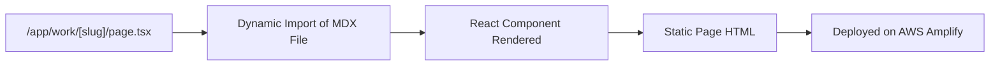
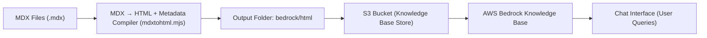
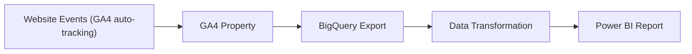
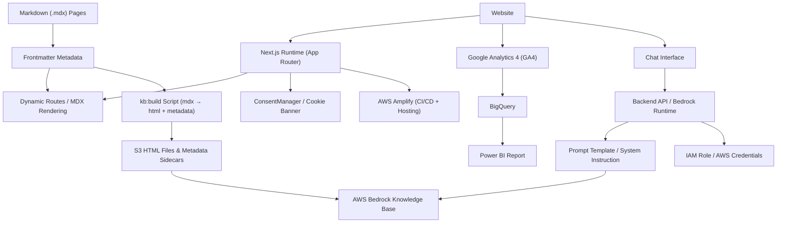

import { Callout, Metric } from "@/components/callouts"

# Building a Portfolio

## Context

In order to showcase my skillset and abilities I thought it'd be best to create a website. I did this using [Next.js](https://nextjs.org/), a [React](https://react.dev/) framework. In case you're unfamilar React is a javascript/typescript based UI framework. Its what lets me create cards like the one below.

<Callout kind="warning">I'm a callout</Callout>

To create this card I have a component, you can think of a component as a function that returns [jsx](https://react.dev/learn/writing-markup-with-jsx).

```tsx
import { Info, CheckCircle2, AlertTriangle, ShieldAlert, Lightbulb, type LucideIcon } from 'lucide-react'

type Kind = 'info' | 'success' | 'warning' | 'danger' | 'tip'

const STYLES: Record<Kind, { icon: LucideIcon; box: string; badge: string }> = {
  info: {icon: Info, box: 'bg-sky-50 border-sky-200', badge: 'bg-sky-100 text-sky-800' },
  success: {icon: CheckCircle2, box: 'bg-emerald-50 border-emerald-200', badge: 'bg-emerald-100 text-emerald-800' },
  warning: {icon: AlertTriangle, box: 'bg-amber-50 border-amber-200', badge: 'bg-amber-100 text-amber-800' },
  danger: {icon: ShieldAlert, box: 'bg-rose-50 border-rose-200', badge: 'bg-rose-100 text-rose-800' },
  tip: {icon: Lightbulb, box: 'bg-violet-50 border-violet-200', badge: 'bg-violet-100 text-violet-800' },
}

export function Callout({
  kind = 'info',
  title,
  children,
  className,
}: {
  kind?: Kind
  title?: string
  children: React.ReactNode
  className?: string
}) {
  const { icon: Icon, box, badge } = STYLES[kind]
  return (
    <aside role="note" className={`rounded-xl border p-4 ${box} ${className ?? ''}`}>
      <div className="mb-2 inline-flex items-center gap-2">
        <span className={`inline-flex items-center gap-1 rounded-full px-2 py-0.5 text-xs ${badge}`}>
          <Icon className="h-4 w-4" />
          <span className="capitalize">{title ?? kind}</span>
        </span>
      </div>
      <div className="text-sm text-neutral-800">{children}</div>
    </aside>
  )
}

export default Callout
```

As you can see there's 5 different types of callouts I've defined.
```ts
type Kind = 'info' | 'success' | 'warning' | 'danger' | 'tip'
```

Additionally I can create the callout like below.

```tsx
<Callout kind="warning">I&apos;m a callout</Callout>
```

## The End Goal

### Functionality

Ignoring the design for a second there was some core functionality I wanted the website to have, namely:

1. A clear hero with a call to action on the [homepage](https://www.peterventon.co.uk/)
2. The ability to showcase projects which push the boundaries of a traditional portfolio
3. A gpt like interactive chat that allows people to ask questions about me with the response linking them to relevant sections
4. An about me page and a place to publish articles using markdown
5. The ability to add mermaid charts into markdown files and precompile the svgs as a static asset

### Design

I'm not a design expert but I wanted the website to represent me. I've always found minamalistic design to be beautiful when done correctly, hence you can probably see the website isn't flashy.

## Building the site

Most of the build moved quickly because I'd already sketched the layout in [Figma](https://www.figma.com/). The main thing I had to figure out early was how to publish articles without pulling in a full CMS.

I went with **Markdown/MDX** so content stays easy to edit and version alongside the code. I configured MDX in `next.config.mjs` with a handful of remark and rehype plugins:

- `remark-gfm` for GitHub-flavoured markdown (tables, task lists, autolinks)
- `remark-math` and `rehype-katex` for LaTeX math rendering
- `remark-frontmatter` and `remark-mdx-frontmatter` to parse YAML frontmatter and export it as a `metadata` object from each MDX file
- `rehype-highlight` for syntax highlighting via `highlight.js`
- `rehype-mermaid` to compile mermaid diagram blocks to SVGs at build time
- `rehype-external-links` to add `target="_blank"` and `rel="noopener noreferrer nofollow"` to outbound links

`remark-mdx-frontmatter` is probably the most important one. It's what lets me read fields like `title`, `description`, and `active` directly in page components without a separate metadata fetch.

### Adding Markdown Support

The default "one MDX file per route folder" pattern (e.g. `app/foo/page.mdx`) didn't work for me since every article would need its own directory. Instead I keep all content together under `src/app/md-pages/`:

```
src/app/md-pages/
  projects/       ← project write-ups
  articles/       ← blog/articles
  kb-internal/    ← knowledge base documents (not all publicly linked)
```

Each content type has its own dynamic route. Projects live at `app/work/[slug]/page.tsx` and import from the `projects/` subdirectory:

```tsx
// app/work/[slug]/page.tsx (simplified)
import { getMdPages } from '@/app/helpers/getMdPages'
import { redirect } from 'next/navigation'

export default async function Page({
  params,
}: {
  params: Promise<{ slug: string }>
}) {
  const { slug } = await params
  const { default: Post, metadata } = await import(`@/app/md-pages/projects/${slug}.mdx`)

  if (!metadata.active) {
    redirect('/bedrock/unreleased')
  }

  return <Post />
}

export function generateStaticParams() {
  const pages = getMdPages('projects')
  return pages.map(p => ({ slug: p }))
}

export async function generateMetadata({ params }: { params: Promise<{ slug: string }> }) {
  const { slug } = await params
  const { metadata } = await import(`@/app/md-pages/projects/${slug}.mdx`)
  return {
    ...metadata,
    openGraph: {
      title: metadata.title,
      description: metadata.description,
      url: `https://peterventon.co.uk/work/${slug}`,
    },
  }
}

export const dynamicParams = false
```

`getMdPages('projects')` is a small helper that reads the filesystem at build time and returns slugs. No hardcoded arrays, no CMS. The `active` frontmatter field works as a draft flag: set it to `false` and the page redirects to `/bedrock/unreleased` so I can keep work-in-progress in the repo without publishing it. `generateMetadata` picks up the same `metadata` export to fill `<title>` tags and Open Graph fields automatically.

```ts
// src/app/helpers/getMdPages.ts
export function getMdPages(directory: 'articles' | 'projects' | 'kb-internal') {
  const files = fs.readdirSync(path.join(process.cwd(), 'src', 'app', 'md-pages', directory))
  return files
    .filter(file => file.endsWith('.mdx') || file.endsWith('.md'))
    .map(file => file.replace(/\.mdx?$/, ''))
}
```

So I end up with clean URLs like `/work/report-migration` and `/articles/dp-700-experience`, and the folder is the single source of truth for what pages exist.


```mermaid
graph LR
  A["/app/work/[slug]/page.tsx"] --> B["Dynamic Import of MDX File"]
  B --> C["React Component Rendered"]
  C --> D["Static Page HTML"]
  D --> E["Deployed on AWS Amplify"]
```

### Integrating AWS Knowledge Base

Since I wanted to add a chatbot to the site to showcase my ability to use cutting edge technology I was happy to see knowledge base supported markdown files natively. The issue was I wasn't using `.md` files, I'm using `.mdx` files. These are exactly the same as markdown but it lets me use react components inside my markdown.

i.e. On my report migration article you'll see the below.

<div className="mt-6 grid gap-3 sm:grid-cols-3">
  <Metric value="100+" label="Reports Rebuilt" note="Over the course of 1 year" />
  <Metric value="5" label="Critical DW issues fixed" note="Issues which impacted our P&L" />
  <Metric value="6x" label="Faster response time" note="Weeks &rarr; Days for complex reports" />
</div>

See the below snippet for the mdx file's content.

```tsx
<div className="mt-6 grid gap-3 sm:grid-cols-3">
  <Metric value="100+" label="Reports Rebuilt" note="Over the course of 1 year" />
  <Metric value="5" label="Critical DW issues fixed" note="Issues which impacted our P&L" />
  <Metric value="6x" label="Faster response time" note="Weeks &rarr; Days for complex reports" />
</div>
```

This isn't standard markdown and not supported by knowlegde base. I could have dropped the custom components just for knowledge base but I thought they provided important content. Therefore I checked for other supported file types in knowledge base and saw it supports html.

This browser is rendering html so all my mdx pages can compile to raw html. In order to do this I prebuild my html content for knowledge base and output it to `bedrock/html`. The script lives at `src/scripts/mdxtohtml.mjs`:

```mjs
import fs from 'node:fs/promises'
import path from 'node:path'
import { pathToFileURL } from 'node:url'
import { evaluate } from '@mdx-js/mdx'
import * as runtime from 'react/jsx-runtime'
import React from 'react'
import { renderToStaticMarkup } from 'react-dom/server'
import { unified } from 'unified'
import rehypeParse from 'rehype-parse'
import rehypeSanitize from 'rehype-sanitize'
import rehypeStringify from 'rehype-stringify'
import rehypeMermaid from 'rehype-mermaid'
import matter from 'gray-matter'
import { Metric, Callout } from '@/components/callouts'

function stripImports(file) {
  return file
    .split(/\n/)
    .filter(line => !/^\s*import\b/.test(line))
    .join('\n')
}

function flattenObject(obj, parentKey = '', result = {}) {
  for (const [key, value] of Object.entries(obj)) {
    const newKey = parentKey ? `${parentKey}_${key}` : key
    if (value && typeof value === 'object' && !Array.isArray(value)) {
      flattenObject(value, newKey, result)
    } else {
      result[newKey] = value
    }
  }
  return result
}

function getPageUrl(filePath) {
  const base = 'https://www.peterventon.co.uk'
  const parts = filePath.split(path.sep)
  const mdPagesDir = parts[parts.length - 2]
  const slug = parts[parts.length - 1].replace(/\.mdx$/, '')
  if (mdPagesDir.toLowerCase() === 'projects') return `${base}/work/${slug}`
  return `${base}/${mdPagesDir}/${slug}`
}

const components = { Metric, Callout }
const MD_FILES_PATH = path.join(process.cwd(), 'src/app/md-pages')
const OUTPUT_PATH = path.join(process.cwd(), 'bedrock', 'html')

async function compileOne(filePath) {
  const raw = await fs.readFile(filePath, 'utf8')
  // gray-matter splits the YAML frontmatter from the MDX body
  const { data: metadata, content } = matter(raw)
  const mdxClean = stripImports(content)

  const { default: MDXContent } = await evaluate(mdxClean, {
    ...runtime,
    useMDXComponents: () => components,
    baseUrl: pathToFileURL(filePath)
  })

  const html = renderToStaticMarkup(React.createElement(MDXContent, { components }))

  const safe = String(
    await unified()
      .use(rehypeParse, { fragment: true })
      .use(rehypeSanitize)
      .use(rehypeMermaid)   // compile mermaid blocks to SVG before writing
      .use(rehypeStringify)
      .process(html)
  )

  const slug = path.basename(filePath).replace(/\.mdx$/, '')
  await fs.mkdir(OUTPUT_PATH, { recursive: true })
  await fs.writeFile(path.join(OUTPUT_PATH, `${slug}.html`), safe, 'utf8')

  // write a metadata sidecar that Bedrock uses for filtering and citations
  const bedrock_metadata = {
    metadataAttributes: {
      url: getPageUrl(filePath),
      ...flattenObject(metadata)
    }
  }
  await fs.writeFile(
    path.join(OUTPUT_PATH, `${slug}.html.metadata.json`),
    JSON.stringify(bedrock_metadata, null, 2),
    'utf-8'
  )
}

async function run() {
  const args = process.argv.slice(2)
  if (args.length === 0) {
    throw new Error('Must specify an argument, to build all run with -a')
  }

  if (args.includes('-a')) {
    // iterate over every subdirectory in md-pages (projects, articles, kb-internal…)
    const directories = await fs.readdir(MD_FILES_PATH)
    for (const d of directories) {
      const files = (await fs.readdir(path.join(MD_FILES_PATH, d))).filter(f => /\.mdx$/.test(f))
      for (const f of files) {
        try { await compileOne(path.join(MD_FILES_PATH, d, f)); console.log('generated html and metadata for', f) }
        catch (e) { console.error('failed to generate html/metadata for', f, '\n', e) }
      }
    }
    return
  }

  for (const arg of args) {
    const abs = path.resolve(arg)
    try { await compileOne(abs); console.log('generated html for', abs) }
    catch (e) { console.error('failed to generate html for', abs, '\n', e) }
  }
}

run().catch(err => (console.error(err), process.exit(1)))
```

`gray-matter` is used to strip the YAML frontmatter before passing the content to `evaluate()` since it would choke on the `---` delimiters otherwise. The extracted `metadata` object then gets written out as a Bedrock sidecar file alongside the HTML. `rehypeMermaid` runs inside the unified pipeline so mermaid blocks get compiled to inline SVGs before the file is written, since the knowledge base has no idea what to do with raw mermaid syntax.

Each file produces two outputs: `slug.html` and `slug.html.metadata.json` with fields like `url`, `title`, `date`, and `stack`. Bedrock uses the sidecar for relevance filtering and to populate the citation URLs in the chat UI.

The `run()` function iterates over subdirectories rather than a flat folder, which matches the same structure the Next.js routes use.

I added this to the npm scripts so I can compile everything with one command. In `package.json`:

```json
"scripts": {
    "dev": "next dev",
    "build": "next build",
    "start": "next start",
    "lint": "next lint",
    "kb:build": "tsx -r tsconfig-paths/register src/scripts/mdxtohtml.mjs"
  }
```

This output folder is what bedrock builds the knowledge base off of so when a user asks a question it is able to have relevant information to answer the user's question. The full design can be seen in the graph below:


```mermaid
graph LR
  A["MDX Files (.mdx)"] --> B["MDX → HTML + Metadata Compiler (mdxtohtml.mjs)"]
  B --> C["Output Folder: bedrock/html"]
  C --> D["S3 Bucket (Knowledge Base Store)"]
  D --> E["AWS Bedrock Knowledge Base"]
  E --> F["Chat Interface (User Queries)"]
```

### Setting Up Google Analytics 4

I want my website to have some unique projects to showcase my diverse skillset. I was thinking about how I can show my PowerBI abilities without creating a generic report from an existing dataset. After a few days of thinking I decided I would build a report based on this website's GA4 (Google Analytics 4) Data.

This would showcase a few of my skills:
1. The ability to use different technologies
2. The ability to create and orchestrate an ETL process to clean data
3. The ability to tell a data story with PowerBI

#### Setting up a Cookie Banner to use GA4
I'm going to be honest, I've never used google analytics before so the task wasn't super trivial. Luckily for widely used technical tools there's always extremely good documentation.

The first thing I learned is I was going to need a cookie banner, since I would be tracking anonymized user data. I decided to use [ConsentManager](https://www.consentmanager.net/en/) to power the cookie banner. I read the [docs](https://help.consentmanager.net/books/cmp/page/implementation-using-server-side-rendering) on how to implement the cookie banner using server side rendering and had the banner up and running within minutes. If you look at this project's github in the App's root layout you'll see:

```tsx
 <html lang="en">
      <head>
        {/* consentmanager script https://help.consentmanager.net/books/cmp/page/implementation-using-server-side-rendering */}
        <Script
          strategy="afterInteractive"
          type="text/javascript"
          data-cmp-ab="1"
          src="https://cdn.consentmanager.net/delivery/autoblocking/780fd577d2e68.js"
          data-cmp-host="d.delivery.consentmanager.net"
          data-cmp-cdn="cdn.consentmanager.net"
          data-cmp-codesrc="16"
          />
        <GoogleAnalytics gaId="G-P6XTRVZP4H" />
      </head>

      <body className={`${rubik.className} antialiased`}>
        <Header />
        {children}
      </body>
    </html>
```

The `<Script />` is handling the cookie banner. ConsentManager's autoblocking script gates the `<GoogleAnalytics>` tag so analytics only fires once the user has accepted cookies. GA4 then handles the basics automatically, things like page views, scroll depth, outbound clicks, and session data, without any extra instrumentation code.

#### From GA4 to Power BI

Once data starts accumulating in GA4 it automatically exports raw event tables to BigQuery via the native GA4 integration. From there I built a transformation pipeline and a Power BI report on top of the real usage data from this site. That process is covered in the [GA4 Analytics Pipeline](/work/ga4-bi) project.


```mermaid
graph LR
  A["Website Events (GA4 auto-tracking)"] --> B["GA4 Property"]
  B --> C["BigQuery Export"]
  C --> D["Data Transformation"]
  D --> E["Power BI Report"]
```

### Custom Event Tracking

GA4 handles the automatic stuff fine, but I also wanted to track intentional interactions like clicking a nav item, a citation link from the chat, or the "Get In Touch" CTA. I built a thin `TrackLink` wrapper around Next.js `Link` to handle this:

```tsx
"use client"

import Link, { LinkProps } from "next/link"
import * as React from "react"

type Props = Omit<React.ComponentProps<'a'>, 'href' | 'onClick'> & LinkProps & {
  gaEvent?: string
  gaParams?: Record<string, string>
}

export default function TrackLink({
  gaEvent = "link_click",
  gaParams,
  href,
  ...rest
}: Props) {
  return (
    <Link
      href={href}
      {...rest}
      onClick={() => {
        const h = typeof href === "string" ? href : href?.pathname ?? String(href)
        window.gtag?.("event", gaEvent, { href: h, ...gaParams })
      }}
    />
  )
}
```

The default event is `link_click` but any component can pass a custom `gaEvent` and `gaParams`. The `?.` optional chaining means it does nothing if GA4 hasn't loaded yet (i.e. the user hasn't accepted cookies), so there's no console noise. The header fires `nav_click` and `cta_click` directly on `onClick` handlers using the same `window.gtag` pattern.

### Building the Header

The header took a bit more work than I expected.

#### Scroll hide

I wanted the header to hide when you scroll down and reappear when you scroll up, the same pattern you see on Medium and GitHub. I used framer-motion's `useMotionValueEvent` to watch `scrollY` without triggering re-renders on every pixel:

```tsx
const { scrollY } = useScroll()

useMotionValueEvent(scrollY, "change", (latest) => {
  const prev = scrollY.getPrevious() ?? 0
  setIsAtTopOfPage(latest <= 100)
  if (latest > prev && latest > 30) setHidden(true)
  else if (latest < prev) setHidden(false)
})
```

The `motion.header` then animates between `y: 0` and `y: "-100%"` using a spring so the transition doesn't feel jarring:

```tsx
<motion.header
  animate={{ y: hidden ? "-100%" : 0 }}
  transition={{ type: "spring", stiffness: 600, damping: 40, mass: 0.6 }}
  className="sticky top-0 z-50 bg-white/70 backdrop-blur"
>
```

The border on the bottom only appears once you've scrolled past the top (`isAtTopOfPage`), so the hero page looks borderless.

#### Nav pill animation

The active nav item and hovered item share one animated highlight using framer-motion's `layoutId`. Giving the same `layoutId` to a `motion.div` inside each nav item means framer-motion automatically moves it between items when focus changes:

```tsx
{(active || hovered === i) && (
  <motion.div
    layoutId="nav-pill"
    className="absolute inset-0 rounded-full bg-black/10"
    transition={{ type: "spring", stiffness: 500, damping: 40, mass: 0.6 }}
  />
)}
```

No manual position calculations, no CSS transitions to coordinate. It's probably my favourite framer-motion feature.

#### Animated burger icon

For mobile I built a custom SVG that morphs the three burger lines into an x using framer-motion path animation:

```tsx
<motion.svg width="24" height="20" animate={open ? "open" : "closed"}>
  {/* top line → top-left to bottom-right diagonal */}
  <motion.path
    variants={{
      closed: { d: "M 3 4.5 L 21 4.5" },
      open:   { d: "M 4.5 4.5 L 19.5 19.5" },
    }}
    transition={{ type: "spring", stiffness: 400, damping: 35 }}
  />
  {/* middle line → fades out */}
  <motion.path
    d="M 3 10 L 21 10"
    variants={{ closed: { opacity: 1 }, open: { opacity: 0 } }}
  />
  {/* bottom line → bottom-left to top-right diagonal */}
  <motion.path
    variants={{
      closed: { d: "M 3 15.5 L 21 15.5" },
      open:   { d: "M 4.5 19.5 L 19.5 4.5" },
    }}
    transition={{ type: "spring", stiffness: 400, damping: 35 }}
  />
</motion.svg>
```

Framer-motion interpolates the SVG `d` path attributes between variants so the lines actually animate into the x shape rather than just swapping icons. The mobile menu uses `AnimatePresence` with spring physics and closes automatically when the route changes via a `useEffect` watching `pathname`.

### The Chat API

The `/api/ask` route is a Next.js API route that calls AWS Bedrock on the server side.

```ts
import { BedrockAgentRuntimeClient, RetrieveAndGenerateCommand } from "@aws-sdk/client-bedrock-agent-runtime"
import fs from "fs"
import path from "path"

const client = new BedrockAgentRuntimeClient({ region: "eu-central-1" })

export async function POST(req: NextRequest) {
  const { question } = await req.json()

  // system prompt is written to disk during the Amplify build (fetched from SSM)
  const bedrockSystemPrompt = fs.readFileSync(
    path.join(process.cwd(), "bedrock_system_prompt.txt"), "utf8"
  )

  const cmd = new RetrieveAndGenerateCommand({
    input: { text: question },
    retrieveAndGenerateConfiguration: {
      type: "KNOWLEDGE_BASE",
      knowledgeBaseConfiguration: {
        knowledgeBaseId: process.env.BEDROCK_KB_ID!,
        modelArn: process.env.BEDROCK_MODEL_ARN!,
        generationConfiguration: {
          promptTemplate: { textPromptTemplate: bedrockSystemPrompt },
        },
        retrievalConfiguration: {
          vectorSearchConfiguration: { numberOfResults: 6 },
        },
      },
    },
  })

  const resp = await client.send(cmd)

  // deduplicate citations — multiple retrieved chunks often come from the same page
  const citationsMap = resp.citations
    ?.flatMap(c => c.retrievedReferences || [])
    ?.reduce((acc, r) => {
      const url = r.metadata?.url ?? "/bedrock/missing"
      const title = r.metadata?.title ?? "Untitled document"
      const existing = acc.get(url)
      if (existing) existing.count += 1
      else acc.set(url, { title, url, count: 1 })
      return acc
    }, new Map())

  return NextResponse.json({
    answer: resp.output?.text,
    citations: citationsMap ? Array.from(citationsMap.values()) : [],
  })
}
```

The system prompt lives in `bedrock_system_prompt.txt` which gets written to disk during the Amplify build when SSM secrets are fetched. Reading it from a file at runtime means I can update the prompt in AWS without redeploying, and it avoids the size limits you'd hit storing a longer prompt in an env var.

Bedrock returns individual chunk references and a long article can contribute several chunks to the same answer. I reduce these with a `Map` keyed by URL so the UI shows one citation per source with a count, rather than the same link repeated. If a document somehow has no URL in its metadata the citation points to `/bedrock/missing` which is a dedicated route rather than a broken link.

### Conclusion

There ended up being more to this than I expected. Writing the MDX to HTML compiler, wiring up the Bedrock knowledge base, building the header animations and figuring out consent aware tracking all taught me things I wouldn't have picked up from tutorials alone.

A few things I'd do differently or took longer than expected:

- Getting `evaluate()` to work with the frontmatter stripped correctly took a few attempts. The `gray-matter` split was the fix but it wasn't obvious at first.
- The `layoutId` nav pill is one of those things that looks impressive but took maybe 10 minutes to build once I understood how framer-motion shared layouts work.
- Storing the system prompt as a file rather than an env var was something I figured out after hitting limits. Worth knowing early if you're building anything similar.
- The `languages` option in `rehype-highlight` replaces the default language set rather than adding to it. I only found this out when TSX stopped highlighting after I added Dart support.

The full design of the website (at least as of the time of publishing this article) can be seen below:


```mermaid
graph TD
    %% Frontend
    A["Website"] --> A1["Next.js Runtime (App Router)"]
    A1 --> A2["Dynamic Routes / MDX Rendering"]
    A1 --> A3["ConsentManager / Cookie Banner"]
    A --> B["Google Analytics 4 (GA4)"]
    A --> E["Chat Interface"]

    %% Content layer
    I["Markdown (.mdx) Pages"] --> I1["Frontmatter Metadata"]
    I1 --> A2
    I1 --> J["kb:build Script (mdx → html + metadata)"]
    J --> H["S3 HTML Files & Metadata Sidecars"]
    H --> G["AWS Bedrock Knowledge Base"]

    %% Backend / AI flow
    E --> F["Backend API / Bedrock Runtime"]
    F --> F2["Prompt Template / System Instruction"]
    F2 --> G
    F --> F1["IAM Role / AWS Credentials"]

    %% Analytics flow
    B --> C["BigQuery"]
    C --> D["Power BI Report"]

    %% Hosting
    A1 --> Z["AWS Amplify (CI/CD + Hosting)"]
```
