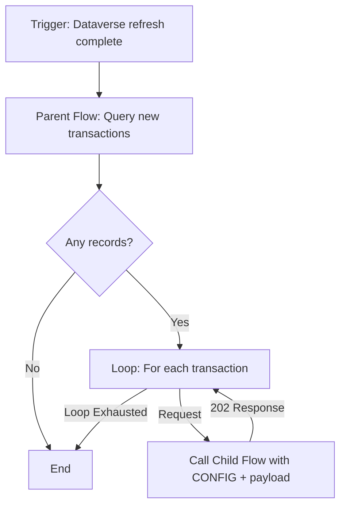
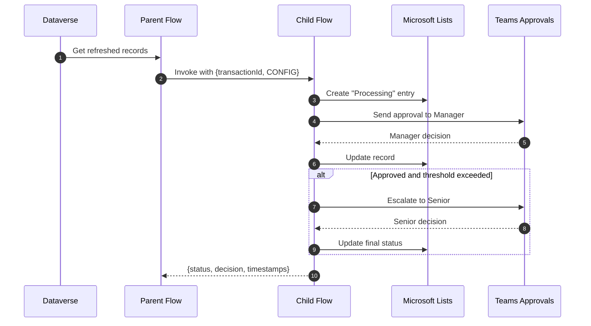

import { Callout } from "@/components/callouts"

# Power Automate at Scale

## Context

The business needed a reliable way for managers and senior leaders to monitor transactions with suppliers, especially those above a defined threshold.  
Manual checks caused delays and made it difficult to maintain consistent oversight.

To solve this, I designed and implemented a Power Automate solution that used a **parent–child flow pattern**. This approach allowed the system to process transactions at scale while remaining easy to maintain and extend.

---

## Why a Parent Child Flow Design

Flows often become difficult to maintain when logic and orchestration are combined in a single file.  
By separating these concerns, the solution became simpler to update, test, and scale.

1. **Clear Purpose** — The parent handles orchestration, while the child focuses on processing a single record of data.  
2. **Maintainability** — Changes to the child flow don’t affect the parent, reducing risk when business rules change.  
3. **Scalability** — The parent can loop through thousands of records and delegate each one to the child.  
4. **Error Handling** — A single record failure doesn’t stop the rest of the batch from running.  
5. **Reusability** — The child flow can be reused anywhere the same transaction logic applies.  
6. **Asynchronous Processing** — Each child flow runs independently, allowing multiple records to process in parallel.

These principles are familiar to developers but not always obvious in low-code tools.  
By applying them in Power Automate, the result is a system that is **robust, scalable, and easy to manage**.

<Callout kind="tip" title="Design Takeaway">
Even within low-code environments, traditional software principles like separation of concerns and single responsibility dramatically improve long-term maintainability.
</Callout>

---

## The Solution

### Dataverse as the Data Source

The solution uses **Power Query** to load transaction data into Dataverse and **Power Automate** for orchestration and processing.

#### Power Query Steps
1. **ERP Connection** – Retrieves purchase orders above the threshold updated in the last 24 hours.  
2. **Microsoft Lists Connection** – Fetches all existing records used to track processing status.  
3. **Merge and Filter** – Combines both datasets and returns only records that have not yet been processed.

The result is a Dataverse table refreshed daily.  
Each record represents one transaction awaiting review.

Benefits:
- **Auditability** – Every run corresponds to a real transaction.  
- **Efficiency** – Only unprocessed items are passed to the flow, avoiding wasted calls and capacity.

---

### The Orchestrator (Parent Flow)

The parent flow coordinates the entire process.  
It runs after Dataverse refreshes and handles record distribution.

1. Triggers after the daily data refresh.  
2. Retrieves new transactions from Dataverse.  
3. Loops through each record and sends it to the child flow as a payload.

---

### The Record Processor (Child Flow)

The child flow receives a transaction payload and applies configurable business logic through a **CONFIG** object.

1. Parses the incoming payload and validates key fields.  
2. Creates an entry in Microsoft Lists marking the record as “Processing.”  
3. Sends an approval request to the requester’s manager in Teams.  
4. Updates the list record with the decision.  
5. If approved and over a defined threshold, escalates to a senior approver.  
6. Updates the record with the final decision and timestamps.

---

## Outcome

This automation gave managers and leaders **real-time visibility** into high-value supplier transactions.  
Every approval became **tracked, auditable, and consistent**, reducing manual checks and improving compliance.  

The modular design proved that Power Automate can support enterprise-grade automation when built with DevOps principles in mind.  
It also set a foundation for extending the pattern into future business processes that require the same reliability and scalability.
